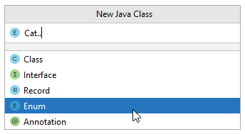

# Create Category
The Category is just an enum ([read more here](https://docs.oracle.com/javase/tutorial/java/javaOO/enum.html)), i.e. a fixed list of values.

Create a new class/enum, called `Category` in the same package as the other two classes (Main, Utils).

The code looks like this:

```java
public enum Category {
    ELECTRONICS,
    GROCERY,
    CLOTHES
}
```

Notice the `enum` type, instead of `class`, in the first line.\
We now have a type called `Category`, with a set of possible values: [electronics, grocery, clothes].

The convention is to all upper case enum value names.

Your code should now compile again, now that the `Utils` knows about a `Category`.

### Notice
When creating a new class, you can actually select it to be an enum:



Or, you can just create a normal class, and change our `class` with `enum`.

