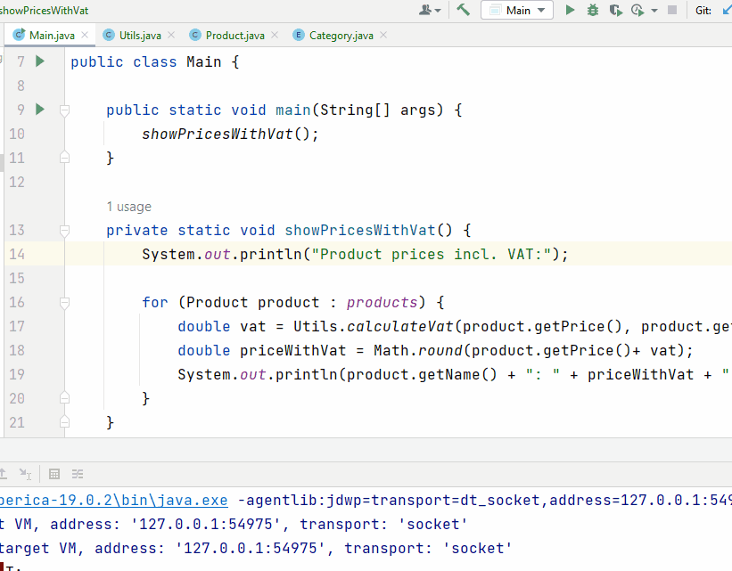

# Breakpoints

Breakpoints are placed next to lines of code. 
When running your program in debug mode (shown later), 
your program will pause execution at the break point, 
and you can inspect all kinds of information.

Now, suppose we don't like the numbers being calculated, maybe we suspect an error,
and we want to understand how the calculations are made by debugging our program.

## Setting a breakpoint
A **breakpoint** is placed in the _**gutter**_. 
This is the area just to the right of the line numbers in a class, see below.\
A breakpoint is a small red dot (( )).\
You can theoretically place as many breakpoints, as you wish, all over your program.\
A breakpoint is removed by clicking it again.

In our program, all calculation results are shown by 
the `ShowPricesWithVat` method, so, let's put a 
breakpoint on the first line of this method, 
and run the program in debug mode, like so:

Notice the red dot in the _gutter_ in the gif below.\
Then see how the debugging is started by running the program using the little bug button, next to the play button.\
Finally, when the code execution hits the line with the breakpoint, the execution is paused, and the line is highlighted.

See this gif:

Now, give it a go yourself.

Let the program execution be paused here, and go to the next slide.