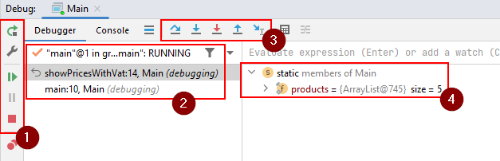

# The Debug Window

After we start debugging, the program stops at the breakpoint. 
To examine the state of the paused program, we use the Debug window.

This window contains all kinds of information:

The debug window should automatically appear at the bottom of IntelliJ, when you run the program in debug mode, and hit a breakpoint.

1) Here we have a few buttons, the relevant are from the top:
   1) Curved green arrow: restart program
   2) Green play arrow: resume program from where it is currently pause
   3) Grey pause icon: if your program is running, you can press this button to pause at the current execution point. 
   3) Red square: terminate program
   4) At the bottom, the two red dots, this will show a list of all your breakpoints.
5) The call stack. I.e. which method has called which method, which has then called another method. Basically you can see the trace of methods called to arrive at the current location. In this case we can see the `main` has called `showPricesWithVat`.
6) The debugging tools, used to navigate and control execution of your code. They will be introduced over the next few slides.
7) The various variables and their values, known at the current breakpoint.

While still paused, go to the next slide.