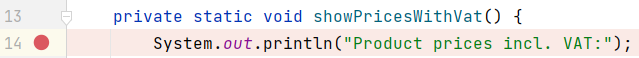
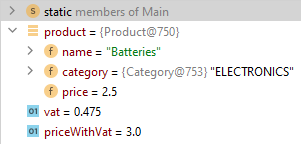

# Stepping Over Code

Run your program again, with debugging, it should pause at the break-point here:

Let's begin with stepping over the `Utils.calculateVat(...)` method in the for-loop.\
We will pause in line 19, i.e. the next print-out, and inspect the information.\
It looks like this:

These are the steps shown:

1) Program started with debugging, i.e. the little bug-button
2) Program stops execution at break-point
3) The execution is advanced one line at a time with the <kbd>Step Over</kbd> button.
4) After line 17, we can see the value of the `vat` variable: 0.475
5) After line 18, we can see the value of the `priceWithVat` variable: 3.0
6) Both the values are shown next to the line of code, and also in the inspector at the bottom.
7) We can also inspect the specific `product` instance, we are currently working with. It is the "Batteries"

Here is the information, when the program is paused at line 19:

