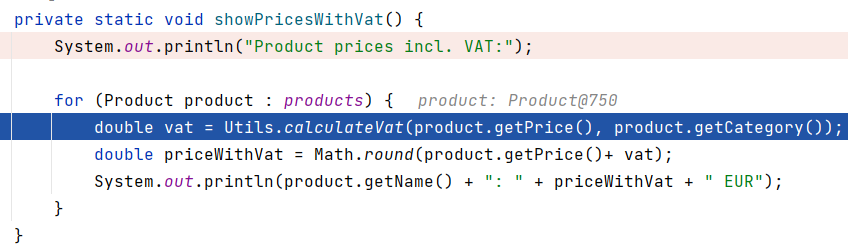

# Stepping Into Code

Stepping into code is used when you want to enter the method at the current line of execution, and pause inside that method.

E.g. if you are paused here, at line 17, and want to see what happens inside `Utils.calculateVat(..)`, you will use the <kbd>Step Into</kbd> button.

Let's try. Rerun the program, with debugging. It pauses at line 14 (or you can remove the current break-point, and create a new), 
step over until the execution is paused at line 17. As shown above.

Now, we want to <kbd>Step Into</kbd>, which means we enter the method `calculateVat`, and continue from _its_ beginning.

When paused at line 17, press the button, or <kbd>F7</kbd>:

I had to press it twice, first it highlighed the method, then at second press, it entered the method.\
The execution is now paused here:

Now, inspect the values in the inspector at the bottom, as you <kbd>Step Over</kbd> until execution exits the method again.

