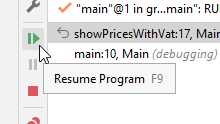
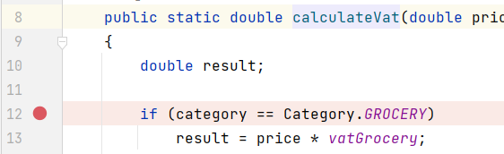

# Resuming the Program

At any time, you can resume program execution. The program will run till the next breakpoint, if any.

E.g. if you have a loop with several lines of code, 
and your are looking for something specific after a couple of iterations, 
maybe you don't want to use step-over all the way. 
Put a break point at the beginning of the loop, and use <kbd>Resume Program</kbd> to iterate through loops.

Let's try it out.

Terminate your program.\
Remove your break-points.\
Create a new break-point inside `calculateVat()`, here:

Run your program, it should pause the your break-point.\
When you click <kbd>Resume Program</kbd>, execution stops here again, but this time it is for the second product. 
I.e. the second iteration of the for-loop. Pressing <kbd>Resume Program</kbd> again pauses at this line again, now for the third product.