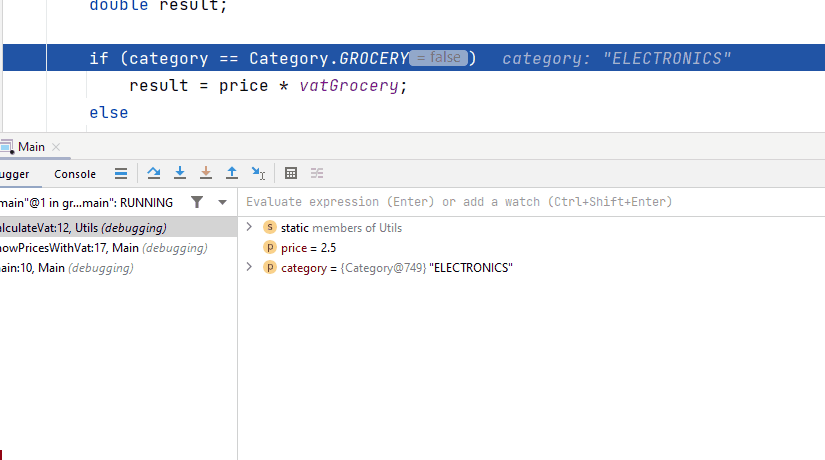
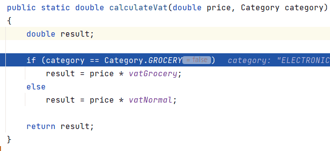

# Evaluating Expressions

During debugging, you can evaluate any expression in the context of the current execution point. By "evaluate", I mean "run code".\
Say, we want to evaluate the insides of our `if`-block:

We can select parts of the code and use the `Evaluate expression` feature to execute that piece of code, like this:

You can either use the pop-up window, or the input field in the inspector.

Alternatively, you can hold down <kbd>alt</kbd> and click on parts of your code for evaluation. Below, <kbd>alt</kbd> is held down. Notice the underline indicating what code is executed, when clicking on it:

