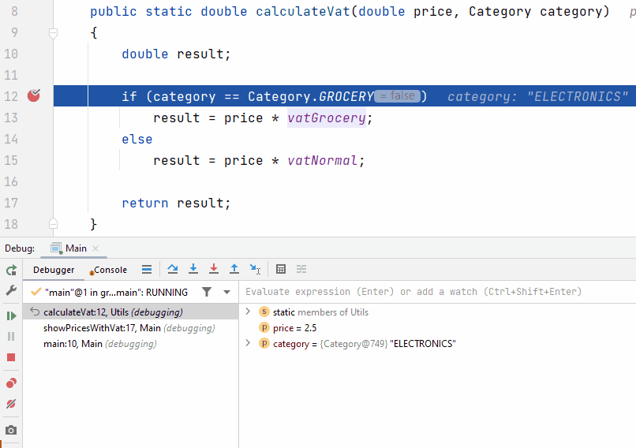

# Adding Watches

If you're interested in how a particular expression changes during program execution, you can add it as a watch. Either a variable, or an expression.\
By default, watches are shown together with local variables in the debugging inspector, and updated (if needed) at each step through the application.

Let's add our expression to watches, we can then see how it changes through executions:

1) Select the expression `category == Category.Grocery`.
2) In the context menu (right click), select Add to Watches. Or create a watch manually, see below. Notice the glasses icon next to your watch.
3) Press <kbd>F9</kbd> or click the <kbd>Resume Program</kbd> button in the Debug window.
4) Notice how the watched value changes.

