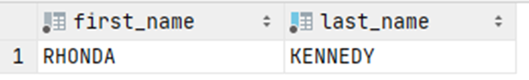

# Exercise 4

What is the name of the customer who lives in the city 'Apeldoorn'?

<details>
<summary>Show answer</summary>



</details>

<br/>

<details>
<summary>Show SQL</summary>

```sql
SELECT first_name, last_name
FROM customer
WHERE address_id IN (
    SELECT address_id
    FROM address
    WHERE city_id = (
        SELECT city_id
        FROM city
        WHERE city = 'Apeldoorn'
        )
    );
```

</details>