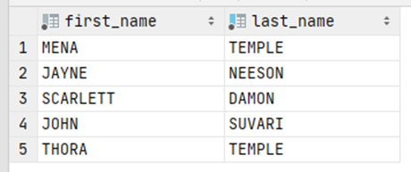

# Exercise 6

Which actors (their names) were in the film 'INTERVIEW LIAISONS'?

<details>
<summary>Show answer</summary>



</details>

<br/>

<details>
<summary>Show SQL</summary>

```sql
SELECT first_name, last_name
FORM actor, film_actor
WHERE film_actor.actor_id=actor.actor_id
AND film_actor.film_id IN (
    SELECT film_id
    FROM film
    WHERE title='INTERVIEW LIAISONS'
    );
```

</details>