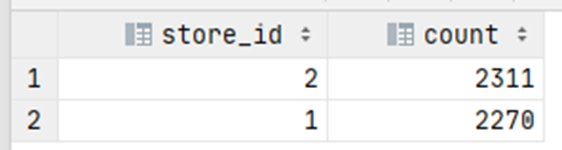

# Exercise 8

Show how many inventory items are available at each store.

<details>
<summary>Show answer</summary>



</details>

<br/>

<details>
<summary>Show SQL</summary>

```sql
SELECT store.store_id, COUNT(inventory_id)
FROM store, inventory
WHERE inventory.store_id = store.store_id
GROUP BY store.store_id;
```

</details>