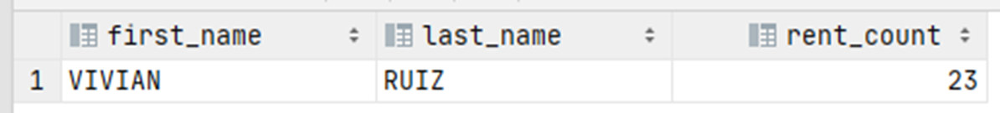

# Exercise 9

How many times have VIVIAN RUIZ rented something?

<details>
<summary>Show answer</summary>



</details>

<br/>

<details>
<summary>Show SQL</summary>

```sql
SELECT first_name, last_name, COUNT(payment.customer_id) AS rent_count
FROM payment, customer
WHERE payment.customer_id = customer.customer_id
AND payment.customer_id = (
    SELECT customer_id
    FROM customer
    WHERE fist_name = 'VIVIAN'
    AND last_name = 'RUIZ'
    );
```

</details>