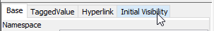
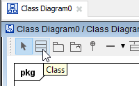
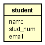

# Inital visibility settings

A normal class diagram will have information such as methods, types, visibility. We don't want that.

Open the "Class Diagram0" file, the one you created in the previous step (see image below). When it is selected in the "Structure" view, you get various settings in the bottom of the left side panel.

First, on the left side panel, we want to remove the **Frame Visibility** (not strictly necessary, just a looks a bit cleaner):

Then, we need to set the Initial Visibility of several things.

That is found in the left side menu:

**Uncheck** the following options:
* Operation Compartment
* Attribute and Operation Visibility Kind
* Attribute Type

Now, whenever you create a new class, either by double clicking on the canvas of the "Class Diagram0" file, or use the class tool:

You will get a class which looks more like an ER entity:

