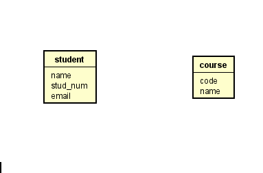

# Simple relationships

Relationships are drawn with an association line without end arrows like this. The drag direction (from -> to) is relevant.

When the relationship is selected, you can put on the multiplicity.

The relationship needs a description and reading direction. 
So, with the relationship selected, go to the left-hand-side menu again, under the "Base" tab, and type in a name

This results in the following:

In case you mess up the arrow direction of the name, you can right-click the relationship line and flip the name direction:

