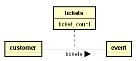

# Relationship attributes

These kind of attributes belong to a relationship between two entities.

For example, a Customer can buy multiple tickets to some Event.\
The number of tickets bought cannot be on neither Customer, nor Event, but is something which exists for each pair of Customer and Event.
Therefore, we make it a relationship attribute.

It looks like this:

The full drawn line is the relationship, the dotted line goes to the relationship attributes.
Notice Astah needs a name for this box, which also becomes the name of the relationship. 
I have found no way around this.

It is done as follows:

