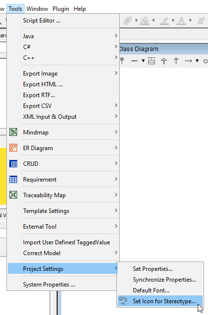
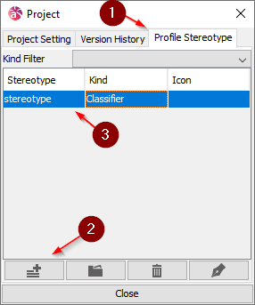
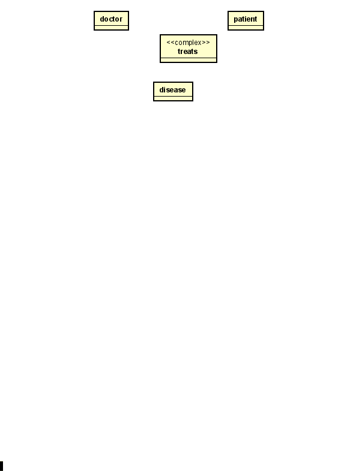

# Complex relationships

Sometimes 3 or more entities are involved in a relationship, called a complex relationship (or ternary relationship, if there are 3 entities).

This is represented with a diamond.

In Astah this is not possible out of the box, so we need to set up some things.

### Setup

First, we need an icon for the diamond. I have just drawn the below in Inkscape:

You should be able to right-click the image and download. Or create your own.

Then the settings.

Open the menu: Tools -> Project Settings -> Set Icon for Stereotype:

In this menu, go to Profile Stereotype ((1)) and create a new ((2)):

Then double click on the new stereotype ((3)).

In this menu, change the Stereotype name ((1)), and click on the "..." ((2)) to select an icon.

Select the diamond image.

Click <kbd>OK</kbd>, then <kbd>Close</kbd>

That's the setup.

### Creating the relationship

Create a new class, where the diamond should be, the name of the class is the name of the relationship.\
In this example a _doctor_ **treats** a _patient_ for a _disease_. I.e. **treats** is the relationship.

Select the **treats** class. In the left side menu, there is a Stereotype tab ((1)), open it. 
Add a new stereotype ((2)), and call it "complex" ((3)), like the Stereotype icon name above.

Right-click the **treats** class and select "Set Customized Icon". 
This shows a popup, double click on the diamond image.

Your **treats** class should now look like the diamond image. 

Then change the diamond size, and draw relationships. 

The name of the complex relationship is now below the diamond. With a dirty hack, we can move the name inside the diamond.

### Name in diamond

Double click on the name, "treats", so it's editable:

Then replace the name with a white space " ".

After that, use the Text tool to create a text label inside the diamond.

Final result: 

