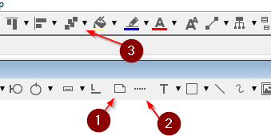

# Complex relationship attributes

Sometimes, a complex relationship also needs relationship attributes. 
This cannot be done in the same way as previous, where only two entities were involved.

The follow hack can be used.

Create a new class to hold the relationship attributes, you should name it as the relationship:

Now, we use the "Line"

to draw a line between the _treats_ diamond, and the _treats_ class. Then, select the line, and change the type:

This is not a particularly good solution, because the line is not anchored to anything, so if you drag around either the diamond or the treats class, the line does not follow along. You will have to pay attention to that detail.

### Alternative idea

Currently, the diamond shape is "see-through". 
If you made a shape with white interior, you could create a note ((1)), scale it down, 
connect the note with a note anchor ((2)) to the treats class. 
Then move the note into the diamond and send it to the back ((3)) to hide it.

Using this approach, the dotted line is at least anchored at one end.