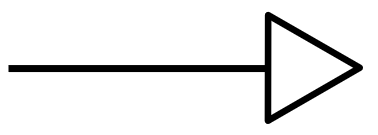
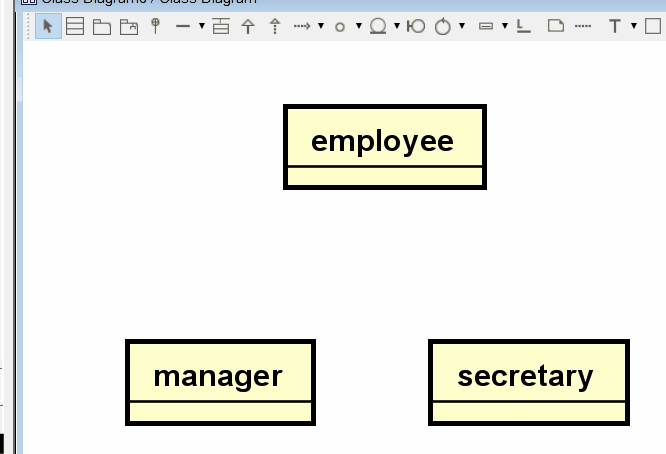
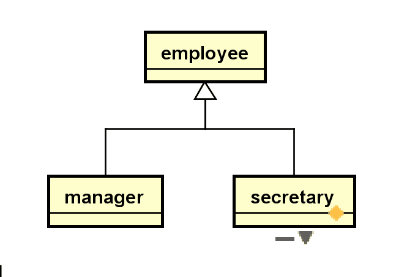

# Inheritance

With the Extended E/R Diagram, inheritance is added to the notation.

It is the same arrow, as we use for class diagrams, i.e. a full drawn arrow, with a not-filled-in closed arrow-head, like this:

There are, however, a few more details for inheritance in E/R diagrams.

Now, in Astah:

Furthermore, in E/R Diagrams, we need to add the participation and disjoint constraints, e.g. {optional, or}, {mandatory, and}, etc.

You do this, by clicking one of the inheritance arrows, and add a constraint:

Alternatively, you can just give the arrow a name (under the base tab, before switching to constraints), or use a text box.