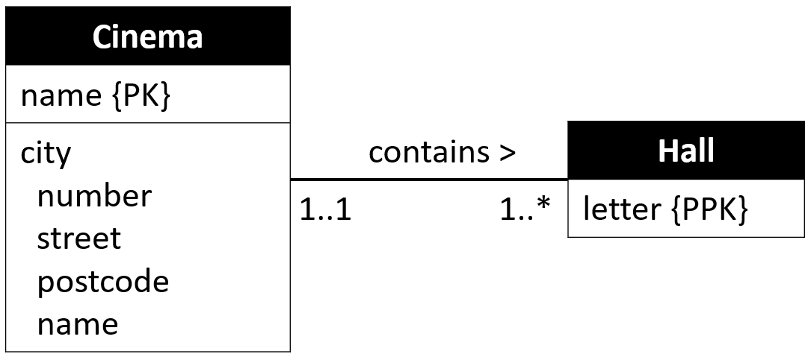

# Weak Entities

Weak entities are the kind, which cannot have an instance without referencing another entity instance. Examples:
* A Profile cannot exist without a User
* A Ticket cannot exist without Customer and Concert
* A Room cannot exist without a Building
* A loan must point to some person
* A payment cannot be done without a loan
* A Netflix profile cannot exist without an account

Weak entities are mapped similar to strong entities. 
They will at a later point include one or more foreign keys to the "owning" entity.\ 
This is done when mapping relationships.

A weak entity results in a relation, just like strong entities.

* Include all simple attributes
* Composite attributes are broken into simple attributes
* The primary key is partially or fully derived from the owner entity. This means we cannot define the primary key until after all relationships are mapped.
* Multi-values are left out for now
* Derived attributes are included and explained, as in the previous step

It may not always be entirely clear whether an entity is strong or weak. When in doubt, map such an ambiguous entity with the weak.

## General Example

Below is an entity. In this particular case it is very clear that it is weak, because `attr1` is part of the composite primary key, it is marked `{PPK}`.\
However, there is no other `{PPK}` attribute, which is because the complete primary key will include the attribute, which is a foreign key to the owning entity.

It is not always, we are able to mark an attribute with `{PPK}`.


In the above entity, `attr1` is marked as PPK, to indicate this attribute is part of the Primary Key (partial primary key), but is not enough in itself.\
As it is a weak entity, we (usually) need to include one or more foreign keys in a composite primary key.\
This is done in a later step, when the relationship to the owning entity is mapped.

The resulting (currently unfinished) relation:


The primary key is unfinished, so currently we have included a temporary placeholder: `?`.

Often, weak entities are implied by them having a relationship to the "owner entity" with 1..1 on the owner side. This implies the weak entity _must_ reference the strong entity.

#### Note
In theory the primary key of a weak entity will be a composite key, which will include the FK(s) that points to the owner(s)'s PK.

You may have a project with a name, run by a department, which has PK: dep_id.\
The project name itself may not be unique, but combined with the dep_id it can be a key, as a department will not create two projects with the same name.

Sometimes this results in large composite keys (i.e. containing many attributes), and it may be better to introduce a surrogate key.

## Non-general example
A cinema chain has multiple cinemas, a maximum of one per city, so they are identified by city name, e.g. "Cinemaxx Århus", or "Cinemaxx København". A cinema has multiple halls, identified by letters: A, B, C, D, etc.\
Each hall is unique, and uniquely identifiable within a cinema. But multiple cinemas have halls named A, B, C, etc.

This gives us a simple ER diagram:



Clearly "Hall" is a weak entity, owned by the strong entity "Cinema".

Now, each hall is identified by a letter, within a cinema. But halls in different cinemas may have the same letter.\
We can mark the attribute "Letter" as part of the primary key. But we cannot yet define the complete key.\
The result of mapping the "Hall" entity is thus simply:

```json
Hall(letter)
PK: letter, ?
```

until the relationship to the owning entity is mapped.

## No PPK?
Sometimes there is no good attribute to mark as `{PPK}`. We may end up creating a surrogate primary key, and not include the foreign key in the primary key.
