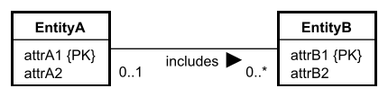

# One to Many, 1:*

For each binary (i.e. only including two entities) 1:* relationship we map it as follows.

We define the `1`-side to be the "parent", and the `*`-side to be the "child".

Post the primary key attribute(s) of the parent-relation into the child-relation as foreign key.

Relationship attributes are posted into the child-relation.

It is not important if it is 0..1 or 1..1.\
It is not important if it is 1..* or 0..*.\
The mapping approach is the same.

The child-entity (EntityB) received a `{PK}` or `{PPK}` in previous steps.

If the parent side has 1..1, it indicates the child-entity is weak, and the `{PK}` of the parent will be included in the composite primary key of the child.

If the child-entity is weak, the `{PK}` is unfinished, and the `{PK}` of the parent is included in the composite primary key of the child.

### Example 1

Given the below simple EER diagram, the child is a strong entity:

We get the following two relations:

### Example 2

Given another simple EER diagram, the child-entity is weak, and `attrB1` is marked as `{PPK}` (or not present at all), i.e. the primary key is unfinished.

The result is (EntityA is same as above):

The primary key of **EntityA** is included in the composite primary key of **EntityB**