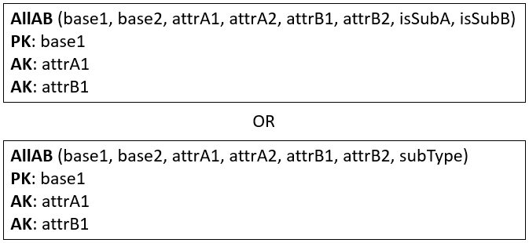
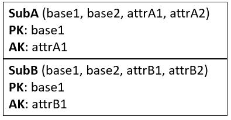

# Inheritance

There are 4 versions when dealing with inheritance. 

Which to pick is determined by the inheritance-constraints (participation and disjoint), as there are four combinations:

* {mandatory, and}
* {mandatory, or}
* {optional, and}
* {optional, or}

Each combination above has a recommended approach to mapping.\
However, sometimes you may have good reason to use an approach other than the recommended.

## {mandatory, and}

It could look like this.

You create a single relation to cover the super- and sub-entities.
You add attributes to indicate whether a row is **SubA** or **SubB** or **SubAB**, this attribute is called a discriminator.\
Usually the sub-types do not define primary keys, and so the primary key is commonly just the BaseEntity's primary key.\
Other Primary Keys (if present) are marked as Alternate Keys {AK}.

You can either add a boolean attribute for each sub-entity in the relation, to say whether the row is A, B, AB, or something else.

Or you can just add a single attribute, which can indicate which combination of sub-entities are used.

The result is either of the below:

If there are many sub-entity-types, a single attribute discriminator may be easier to deal with.

## {mandatory, or}

In this case, it doesn't make sense to combine the Sub-types, because the disjoint constraint is "or". It would lead to many null values. Or if you're not careful, then a row can represent two sub-entities, which should not be allowed according to the constraints.

The solution is to create many relations: one per combination of Base-SubType. I.e. you will get a number of relations equal to the number of sub-types.

From the above example, we would get two relations: Base-SubA, and Base-SubB.

Result:

Naming of the relations is up to you, "BaseA" is perhaps not a fantastic name.

## {optional, and}

Here, we make two relations: 
* one for the super-entity
* one to combine all sub-entities, with discriminator attribute(s) to distinguish the type of each row.

The primary key of the relation for the sub-entities will be the same as the primary key of the base-relation, acting as foreign key as well.

The result:

Here the `subType` attribute tells which type of combination of A, B, or AB it is. Similar to the case for **{mandatory, and}**.\
Alternatively a number of boolean attributes could be used.

## {optional, or}

This is handled with a relation per entity: Base, SubA, and SubB.

The primary keys of sub-relations (if non are present) will be a copy of the primary key attribute(s) of the super-relation.\
The sub-relation will then reference the super-relation.

Result:

## Complex
Sometimes, your inheritance hierarchy may span multiple levels, e.g.:

In this case, it may be easiest to resolve it from the bottom-up.

Sometimes, a super-entity is involved in multiple inheritances, which may really complicate things. You'll just have to use your best judgement.

