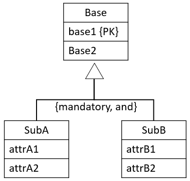
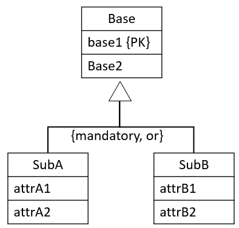

# Inheritance

There are 4 versions when dealing with inheritance. 

## General commment

First, it is important to note that the four versions are _suggestions_. However, there may be cases where a suggestions does not fit well.\
This usually happens if the various entities involved in the hierarchy have various relationships to entities outside the hierarchy.\
Some versions of mapping cannot easily include such relationships. Usually the "{optional,or}" or "{mandatory, or}" versions are well suited for these special cases, if the sub-entities have relationships.\
If only the super-entity have relationships, you are less limited, and can usually follow the suggestion.

Which to pick is determined (suggested) by the inheritance-constraints (participation and disjoint), as there are four combinations:

* {mandatory, and}
* {mandatory, or}
* {optional, and}
* {optional, or}

Each combination above has a recommended approach to mapping.\
However, sometimes you may have good reason to use an approach other than the recommended, as mentioned above.

Also note that sometimes the entities have primary keys defined, sometimes not. 
I believe it is unusual to find sub-entities with primary keys. 

In the below, I have shown only with the super-entity having a primary key. This is probably the most common case.\
If no primary key is marked, you most likely will have to introduce a surrogate key in the relational schema.

## {mandatory, and}

It could look like this.

You create a single relation to cover the super- and sub-entities. I.e. we combine everything inside the red box:

You add attributes to indicate whether a row is **SubA** or **SubB** or **SubAB**, this attribute is called a discriminator.\
Usually the sub-types do not define primary keys (but they may, as shown above), and so the primary key is commonly just the Base-Entity's primary key.\
Other Primary Keys (if present) are marked as Alternate Keys {AK}.

You can either add a boolean attribute for each sub-entity in the relation, to say whether the row is A, B, AB, or something else.

Or you can just add a single attribute, which can indicate which combination of sub-entities are used.

The result is either of the below:

If there are many sub-entity-types, a single attribute discriminator may be easier to deal with, i.e. the lower of the above relations.

## {mandatory, or}

In this case, it doesn't make sense to combine the Sub-types, because the disjoint constraint is "or". It would lead to many null values. Or if you're not careful, then a row can represent two sub-entities, which should not be allowed according to the constraints.

The solution is to create many relations: one per combination of Base-SubType. 
I.e. you will get a number of relations equal to the number of sub-types, each of these relations includes the attributes of the Base entity.

It is displayed here, we get a relation covering the red box, and another covering the blue box:

From the above example, we would get two relations: Base-SubA, and Base-SubB.

Result:

If the sub-entities had primary keys, they are marked as alternate keys.

## {optional, and}

Here, we make two relations: 
* one for the super-entity
* one to combine all sub-entities, with discriminator attribute(s) to distinguish the type of each row (like we saw above).

We define relations per box:

The primary key of the relation for the sub-entities will be the same as the primary key of the base-relation, acting as foreign key as well.

The result:

Here the `subType` attribute tells which type of combination of A, B, or AB it is. Similar to the case for **{mandatory, and}**.\
Alternatively a number of boolean attributes could be used: isA, isB.

## {optional, or}

This is handled with a relation per entity: Base, SubA, and SubB. Like this:

The primary keys of sub-relations (if none are present) will be a copy of the primary key attribute(s) of the super-relation.\
The sub-relation will then reference the super-relation.

Result, where we assume no primary keys were present on the sub-entities:

Alternatively, if the sub-entities had primary keys, we may keep these attributes as primary keys. We still need `base1` as a foreign key, though.

## Complex
Sometimes, your inheritance hierarchy may span multiple levels, e.g.:

In this case, it may be easiest to resolve it from the bottom-up.

Sometimes, a super-entity is involved in multiple inheritances, which may really complicate things. You'll just have to use your best judgement.

