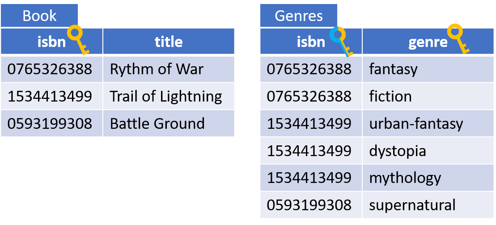

# Multivalued Attributes

These were mentioned on the second slide, about strong entities.
Now we need to deal with them.

Most relational databases do have some kind of attribute type, which can hold multiple values, e.g. in an array. But this approach is not good for queries, and harder to update.

Instead, a new relation is created to keep each value and a reference to the entity occurrence.

Example:

We already have a relation for EntityA.\
We need a new for the multivalued values. 

The result:

### Another more concrete example

Will result in two relations:

You might then have two tables with data, like so:

Each value in the multivalued attribute becomes a row in the value-table. Because of the composite primary key, each value (genre) can only appear once per entity (book). 