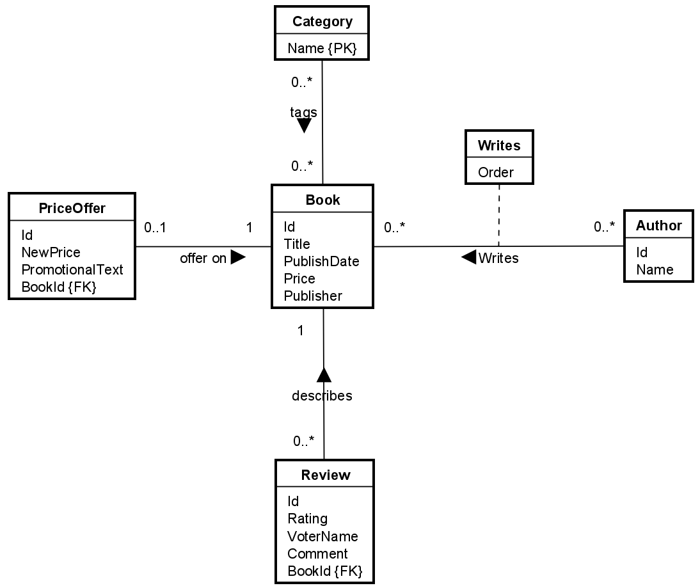

# Introduction

This tutorial aims to show examples of basic CRUD operations using EFC.

I will use the same example, as in the [Setup guide](../EfcSetupIntro/Page.html), shown here:

I am therefore also using the same DbContext, which I set up in the above referenced guide.

In this guide I will give examples of the following:
* Adding new entities
* Retrieving a single entity
* Updating an existing entity
* Deleting an existing entity
* Update relationships between entities

A later guide will dive into more complex queries.