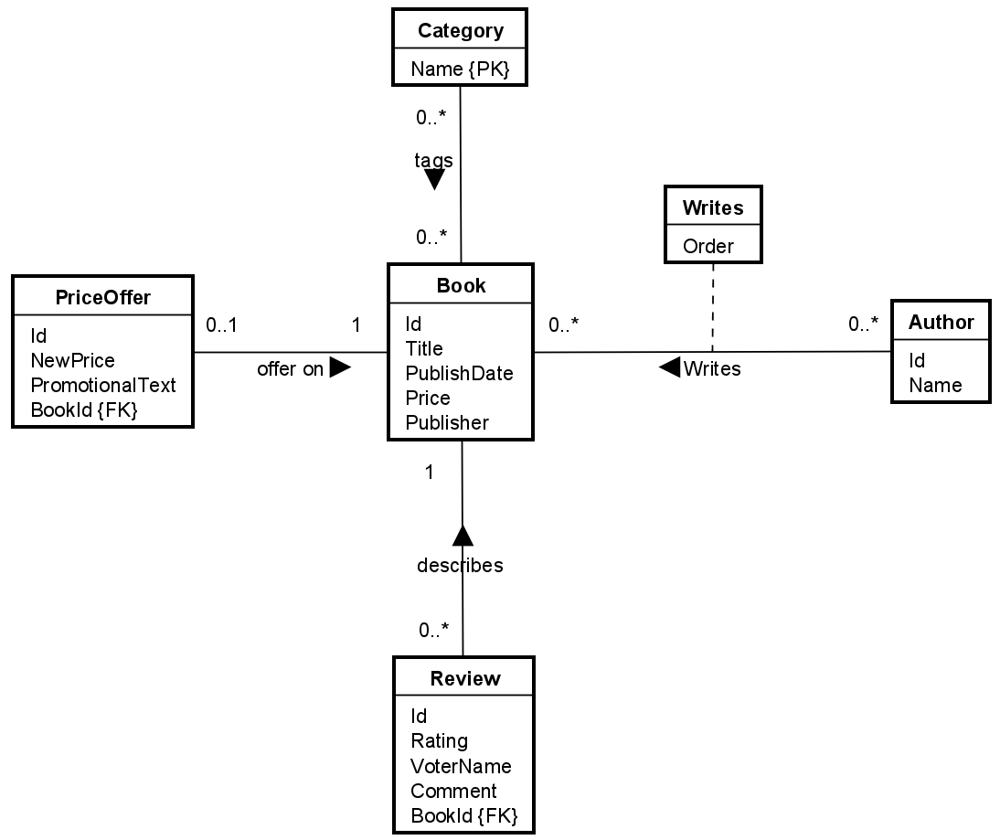

# Introduction
This guide aims to explain:
* How to add EFC to your project
* How to configure domain entities by EFC convention
* How to interact with the DbSets of EFC

## The Example
I have <s>stolen</s> borrowed the example from he book Entity Framework Core in Action by Jon P Smith.

It resembles a book store, with books, authors, book categories, and reviews. The domain model is simple, but it's enough to show the basics of EFC.\
It also covers each of the relevant relationships:
* One-to-one
* One-to-many
* Many-to-many
* Self-referencing
* Many-to-many with relationships attributes

Here is the ER diagram:

## By Convention?
What does this mean?\
EFC has 3 ways to configure the domain model:
1) By convention
2) By attributes
3) By fluent API

We will focus on the first method, it is the simplest.

It means, that if we follow a set of rules when naming our classes and properties, EFC will figure out the relationships between the entities, and primary, and foreign keys.\
This convention makes it easy to get started, because EFC will do most of the work for us.

Sometimes, though, we need to override the convention, or EFC cannot figure out the relationship or property by itself. In these cases, we can use the other two methods. I will not cover these in this guide.

## Source code
Can be found in my GitHub repository here.... // TODO: Add link