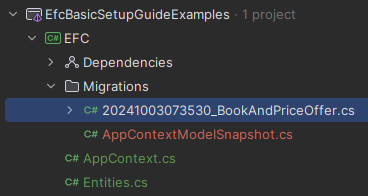
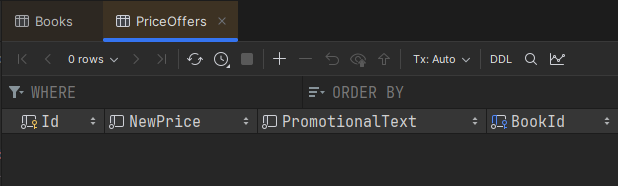

# 1:1 relationships

In this section, we will cover the one-to-one relationships.

From the ER diagram, we can see that the `Book` and `PriceOffer` entities have a one-to-one relationship.

The Book has a price, but sometimes it's on sale, in which case there will be a PriceOffer instance, with a `NewPrice`
and a `PromotionalText`.\
Whenever the sale ends, the PriceOffer is removed, and the Book's price is the regular price. Yes, this is a simple
example, but it's enough to show the concept.

Here's the part of the diagram, we will focus on:


### Implementing the relationship

Let's have a look at the `Book` and `PriceOffer` entities, and how we can connect them.

I am going to include navigation properties in both directions.\
For the 1:1 relationship, you also have to explicitly define the foreign key, otherwise EFC will not be able to figure out which table should contain the foreign key.\
The foreign key should be on the dependent side (optional side), which is the `PriceOffer` side in this case.

Here are the updated classes:

```csharp
public class Book
{
    public int Id { get; set; }
    public string Title { get; set; } = null!;
    public DateOnly PublishDate { get; set; }
    public decimal Price { get; set; }
    public PriceOffer? PriceOffer { get; set; } // Navigation property
}

public class PriceOffer
{
    public int Id { get; set; }
    public decimal NewPrice { get; set; }
    public string PromotionalText { get; set; } = null!;
    public int BookId { get; set; }             // Foreign key
    public Book Book { get; set; } = null!;     // Navigation property
}
```

Notice the PriceOffer property is nullable. We need to make it nullable, because the relationship is optional. Notice
the 0..1 in the diagram.\
Conversely, the BookId and Book properties on PriceOffer are _not_ nullable, because the relationship is required from
the PriceOffer side.\
I only have a foreign key on the PriceOffer side, as this is the common approach in relational databases. The Book side
is optional, and the PriceOffer side is required.

This should be enough for EFC to figure things out.

### Add DbSets

Now, let's add the DbSets to the `BookContext` class.\
I update the class this:

```csharp
public class AppContext : DbContext
{
    public DbSet<Book> Books => Set<Book>();
    public DbSet<PriceOffer> PriceOffers => Set<PriceOffer>();
    
    protected override void OnConfiguring(DbContextOptionsBuilder optionsBuilder)
    {
        optionsBuilder.UseSqlite("Data Source = bookstore.db");
    }
}
```
The DbSet<T> defines a table of the type T. Or Book, and PriceOffer.
You can define the sets as normal properties: `public DbSet<Book> Books { get; set; }`, but I don't get a null warning, when I do the above.\
It says that when accessing Books, we get the Set<Book>() method, which is just a generic way to access a DbSet, defined on the DbContext class.


### Create a migration
Time to create a migration. I call mine `BookAndPriceOffer`.\
This was the first migration, and we get a Migrations directory, with two classes inside:



The `20241003073530_BookAndPriceOffer` class contains the migration code, i.e. what to do to the database to make it match the model.\
The `AppContextModelSnapshot` class contains the model snapshot, which is a snapshot of the current model. It keeps track of the "version" or state of the database, so when new migrations are created, it knows what to do.\
Generally, we don't need to look into these files, but your might inspect the first file, to verify that the migration looks correct.

### Update database
Run the commend to update the database.\
You get the new `bookstore.db` file, which is your SQLite database. Double click it, to set up a connection, so we can inspect and interact with it through the database view.

Inspect the result. You can see this in the migration file above, but sometimes it's easier to see the outcome in the database.\
This means, however, it's more complicated to undo, if the result is not as expected.


Here are my two tables from the new migration.

Books table:


And PriceOffer table:



No data yet, but I do get the columns I expect. We case see the BookId column on the PriceOffer table, which is the foreign key.

### You messed up?
Sometimes you mess up a migration or application to the database. For your case as a student, it's simpler to just delete the Migrations directory and the bookstore.db file.\
This will obviously delete all data, but it's a simple way to start over.\

Alternatively, there are ways to undo migration applications, or to remove the latest migration if it has not yet been applied.\
This is done with commands in the terminal. I leave it up to you to google this, if you need it.