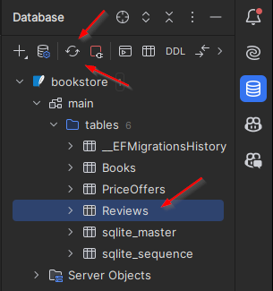

# 1:* relationships

Now, we focus on the one-to-many relationship. This is between the Book and Review entities, as seen here:


I am going to include navigation properties on both sides, and the foreign key on the "many" side, which is the Review
side in this case.

### Implementing the relationship

Here are the updated classes:

```csharp
public class Book
{
    public int Id { get; set; }
    public string Title { get; set; } = null!;
    public DateOnly PublishDate { get; set; }
    public decimal Price { get; set; }
    
    public PriceOffer? PriceOffer { get; set; }

    public List<Review> Reviews { get; set; } = []; // Collection navigation property
}

public class Review
{
    public int Id { get; set; }
    public int Rating { get; set; }
    public string VoterName { get; set; } = null!;
    public string? Comment { get; set; }
    
    public int BookId { get; set; } // Foreign key property
    public Book Book { get; set; } = null!; // Reference navigation property
}
```

The Book has many Reviews, so this is modelled with a "collection navigation property", i.e. the `List<Review> Reviews`
property. This property is instantiated to a new empty list with `[]`, alternatively `new()` or `new List<Review>`. This is just to suppress the null warning.

The Review has one Book, so this is modelled with a "reference navigation property", i.e. the `Book Book` property.\
I also include the `BookId` foreign key on the Review. This is the standard approach in relational databases, where the "many" side has the foreign key.

### Add DbSet

Now, EFC will actually auto-discover connected entities, so even if I don't add a DbSet<Review> to the AppContext, EFC
will still know about it through the Book.\
This will result in a Review table in the database, with a foreign key to the Book table. As it should be.\
However, it's just clearer and simpler to add the DbSet<Review> to the AppContext, so I do that:

```csharp
public DbSet<Review> Reviews => Set<Review>();
```

### Create a migration
Now, we have updated the model, so we need to update the database as well, by creating another migration.\
Do this through the terminal, I have called my migration "AddReviews":


### Apply the migration
Next, update the database to match the latest migration.
I just have to refresh the database view:



And here we can see the Reviews table, with its columns:


There is no change to the Books table, as is expected.