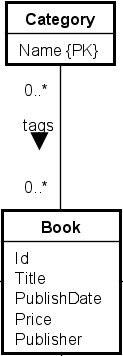
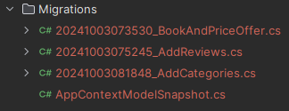
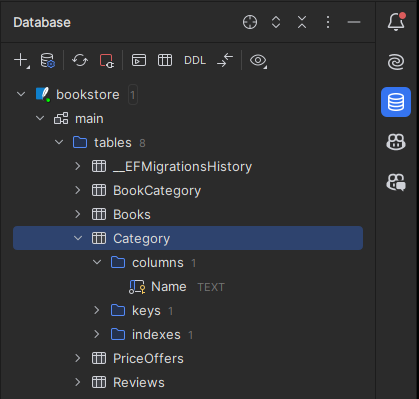

# \*:\* relationship
In this section, we will cover the many-to-many relationships. We can find this relationship between the `Book` and `Category` entities, as seen here:



A Book can be described by many categories, and a Category can describe many books.

This is implemented with a collection nav property on both sides.

### Implementing the relationship
Here's the updated classes:

```csharp
public class Book
{
    public int Id { get; set; }
    public string Title { get; set; } = null!;
    public DateOnly PublishDate { get; set; }
    public decimal Price { get; set; }
    
    public PriceOffer? PriceOffer { get; set; } // Reference navigation property

    public List<Review> Reviews { get; set; } = []; // Collection navigation property
    
    public List<Category> Categories { get; set; } = []; // Collection navigation property
}

public class Category
{
    public string Name { get; set; } = null!;
    
    public List<Book> Books { get; set; } = []; // Collection navigation property
}
```
This time we can't put a foreign key in either of the classes. A \*:\* relationship is modelled with a join table, and EFC will automatically create this for us behind the scenes.\
When we apply the upcoming migration, you will see this join table in the database. My join table is called `BookCategory`.

### Add DbSet
Add a new DbSet to the AppContext class:
    
```csharp
public DbSet<Category> Categories => Set<Category>();
```

### Create a migration
First, remember to define the PK of the Category, see step 8.

Create a new migration, I have called mine `AddCategories`:



### Update the database
Update the database with the new migration, and after a refresh of the database view, you should see the new table:



Notice also the BookCategory table, which is the join table EFC created for us.
