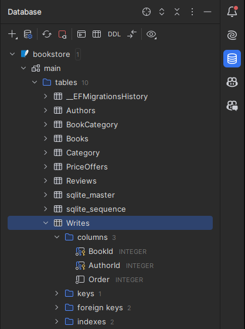

# Relationship attributes
Now, there is only one relationship left, the \*:\* relationship, which is the Writes relationship attribute.\

Relationship attributes only exist on \*:\* relationships.

For the basic \*:\* relationship, EFC automatically created the join table for us. This time, we must be explicit about the join table, 
because of the extra attribute.

Here's the relationship in the diagram:


### Implementing the relationship
As mentioned, we need a new class to bind the Book and Author together, we explicitly create the join table.\
We then implement two 1:\* relationships, one from Book to Writes, and one from Author to Writes.

Here are the updated classes:

```csharp
public class Book
{
    public int Id { get; set; }
    public string Title { get; set; } = null!;
    public DateOnly PublishDate { get; set; }
    public decimal Price { get; set; }
    
    public PriceOffer? PriceOffer { get; set; } // Reference navigation property

    public List<Review> Reviews { get; set; } = []; // Collection navigation property
    
    public List<Category> Categories { get; set; } = []; // Collection navigation property
    
    public List<Writes> WrittenBy { get; set; } = []; // Collection navigation property
}

public class Author
{
    public int Id { get; set; }
    public string Name { get; set; } = null!;

    public List<Writes> Writes { get; set; } = []; // Collection navigation property
}

public class Writes
{
    public int Order { get; set; }

    public int BookId { get; set; }
    public Book Book { get; set; } = null!;

    public int AuthorId { get; set; }
    public Author Author { get; set; } = null!;
}
```

* The Book now has a list of Writes, and the Author has a list of Writes.
* The Writes class has two foreign keys, one for Book and one for Author. It also has two navigation properties, one for Book and one for Author.

See step 8 for how to define the PK of the Writes class.

### Add DbSet
I will add the DbSet of the Author and Writes classes to the AppContext class:

```csharp
public DbSet<Author> Authors => Set<Author>();
public DbSet<Writes> Writes => Set<Writes>();
```

### Create a migration
Create a new migration, I have called mine `AddWrites`:


### Update the database
And then update the database, refresh the database view, and inspect your new Writes table.



This concludes the relationship configuration.