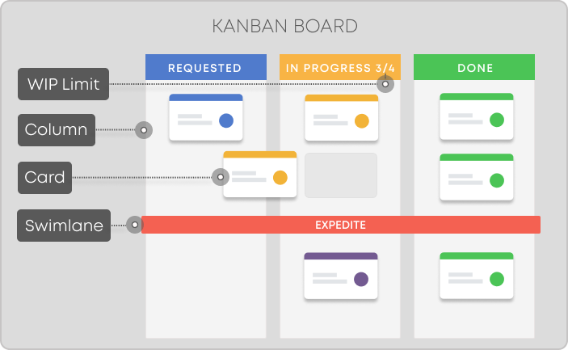

# Introduction

The aim of this article is to introduce the project management process 'Kanban'.

## Intention of this article
Well, you can find tons of articles, videos, etc online. If you google the title, you'll find many of the sort "Kanban in x minutes".
Most of them are a great start. And I also feel many of them are missing some relevant elements.
I have written this article as an attempt to combine all the various information in one place. This also means I can angle it towards your semester project.

## What is Kanban
Kanban is a popular Lean workflow management method for defining, managing, 
and improving services that deliver knowledge work. It helps you visualize work, maximize efficiency, 
and improve continuously. Work is represented on Kanban boards, 
allowing you to optimize work delivery across multiple teams and handle even the most complex 
projects in a single environment.

The Japanese word “kanban”, meaning “visual board” or a “sign”, has been used in the sense of a process definition since the 1950s.

Much of the information in this article is found here: [What Is Kanban? Explained in 10 Minutes | Kanbanize](https://kanbanize.com/kanban-resources/getting-started/what-is-kanban)

It is an agile project management process, similar to Scrum. It is focused on getting things done.

Sometimes teams will combine Scrum and Kanban into variations of "Scrumban". This is discussed later.

## Overview
The Kanban board is the center in this process. It is a board with columns, each column holding multiple task-card.
A task describes something that must be done. Sometimes this is a user story. Sometimes it is something smaller
These tasks travel from left to right across the board, as they are being worked on. This gives a quick overview of the status.\
You may be familiar with websites like [Trello](https://trello.com/) or [Meistertask](https://www.meistertask.com/da). There are many other similar sites, but I usually see these two in semester projects.

A slightly less restrictive, but perhaps more flexible website is [Miro](https://miro.com/). It is basically a free-form online whiteboard, but you can insert a Kanban template. 
Most images in this article is made with Miro's Kanban board template.

Below is an example board [[1]](https://kanbanize.com/kanban-resources/getting-started/what-is-kanban):

The tasks can be just about anything, but **you should still focus on completing user stories**, like you do in Scrum.

Kanban says nothing about:
* team roles
* meetings
* estimates
* iterations

This makes the process simpler, less strict, but also harder to do well. 
It may require a bit more discipline. And you may find you need to add some kind of extra structure, or elements from other known processes, .e.g Scrum.

The following slides will first introduce the very basic idea. Then I will add extra ideas, you can include if you feel like it.
