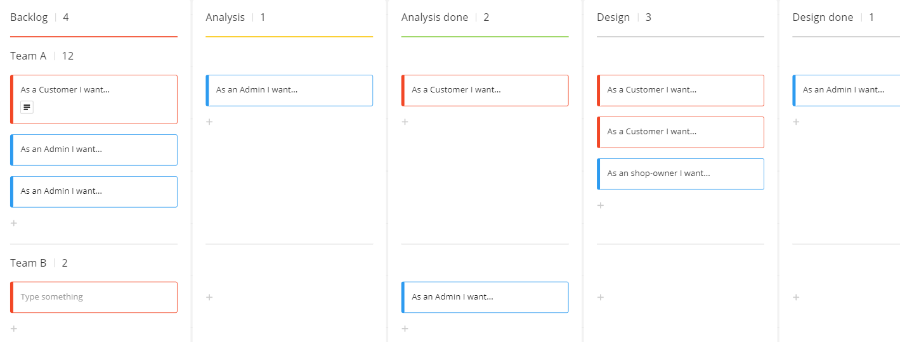

# Swimlanes

For various reasons you might want to divide your Kanban board horizontally. This give you swimlanes, like so:

Notice on the left side, we now have **Team A** and **Team B**. This is a way to divide the tasks between two teams. Maybe you do pair programming. 
Or maybe you want a swimlane per user story, so each swimlane contains the sub-tasks for a specific user story.

The screenshot is from Miro. I haven't seen this feature in other Kanban apps. You could just have two boards. But this does create a combined overview.