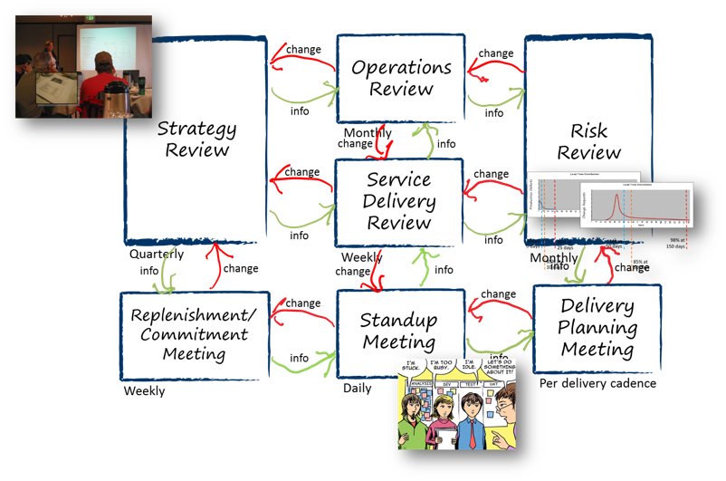

# Meetings

[[3]](https://djaa.com/kanban-cadences/)

Kanban does mention various types of meetings, called cadences. There are seven:

* Kanban Meeting 
* Replenishment Meeting
* Operations Review
* Delivery Planning Meeting
* Service Delivery Review
* Risk Review
* Strategy Review

Most of them are not particularly interesting for you in a SEP group, they are oriented towards an organization, so the meetings may include many people other than the development team.

I will mention the most relevant meetings. The rest can be read about [here](https://www.zentao.pm/blog/seven-cadences-of-kanban-766.html) or [here](https://getnave.com/blog/kanban-meetings/).

## Kanban Meeting
This is essentially your Daily Standup Meeting in Scrum. It's a daily meeting, with a duration of 15 minutes. 
The purpose is to observe and track the task status and to keep the team on the same page. 
The difference is that a Kanban meeting is focusing on the flow. 
The team read from the right of the board to the left, finding the blockage, and ensuring the work moved out of the system

## Replenishment Meeting
Sort of like the Sprint Planning meeting of Scrum.
The purpose is to pull the next few items into the queue of tasks, which should be worked on. It may be that you just order/re-order the backlog column. Or you add new tasks to the backlog column, if you don't include all user stories/tasks from the beginning.\
Essentially, if you are out of tasks to work on, the team needs to figure out which tasks to pull in.\
The meeting is held weekly, or on-demand.

## Delivery Planning
Like the Sprint Review of Scrum.
The purpose is to review the work completed, and decide which items to deliver.

## Triggers
You might define certain events, which can trigger a meeting. E.g.: 
* 
* a column is empty
* a column is full
* _x_ items have been completed
* the "next up"/"sprint" column is empty
* a task entered the analysis/design column (it's often a good idea for the entire group to do the analysis/design together, so they agree on a common understanding)

When a trigger event occurs, you hold an appropriate meeting.

The potential issue is that these triggers can happen at any time, and you may not be able to do a meeting. So, pre-planned meetings have their benefits. But you can mix the two.