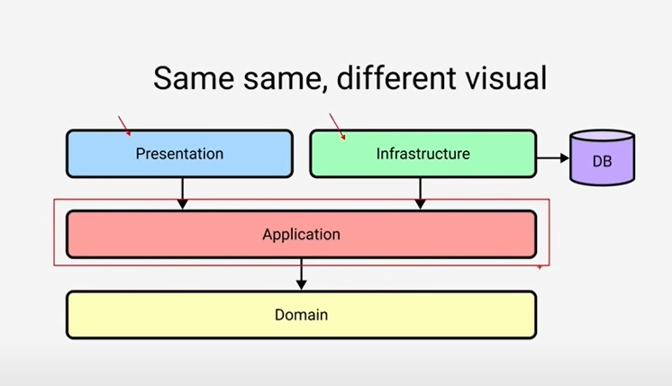
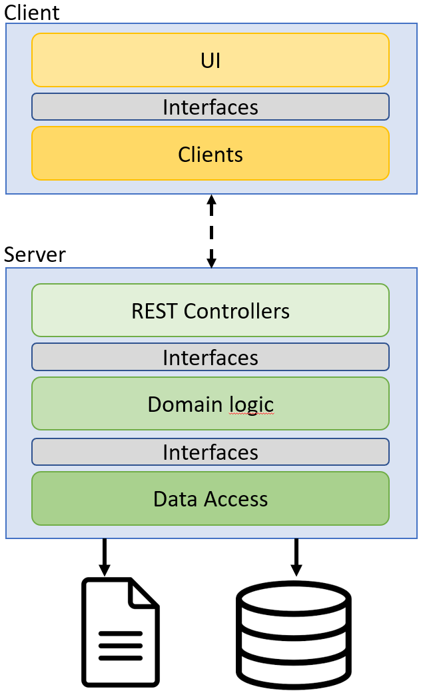
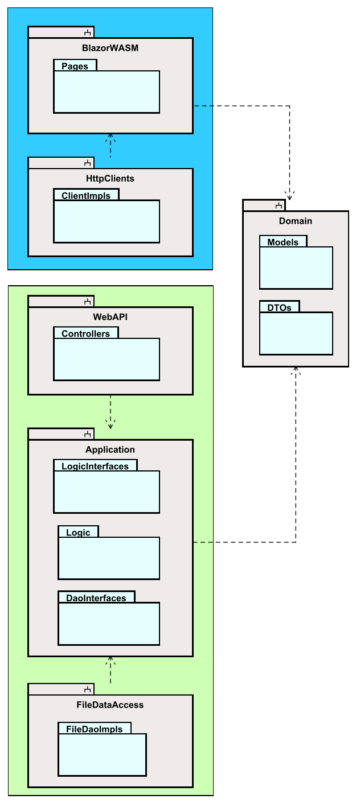

# TODO
Mere om clean. Vis løget, og så den billed fil, der ligger i mappen her, hvor løget er foldet ud. Fundet her
https://youtu.be/fhM0V2N1GpY?t=206

# Architecture intro
First we will take a look at the planned architecture of the Web API.

On the server side, i.e. the Web API, we will use a classic 3-layered architecture:

1) Network layer to receive requests from clients, using REST controllers
2) Application layer, responsible for all business logic
3) Data access layer, responsible for storing/retrieve data from storage (initially a file)

We will let us inspire by existing architecture approaches: Clean architecture, Onion architecture, Hexagon architecture. The interested reader is encouraged to research more about these. I will cover the bare minimum here.

They are very similar ideas, and all advocate the layered approach, each layer separated by interfaces. This should sound familiar, we are applying the Dependency Inversion Principle.

This is the classic diagram for clean architecture:

It is circular, or shaped as an onion. The idea is the closer to the center, the less likely to change. 
Your domain model classes are in the yellow Entities. They don't change.\
The red circle, Use Cases, is your logic. That is also fairly fixed. 
The green layer is in our case REST controllers, i.e. our Web API, and the Data Access implementations, 
i.e. storing data in JSON file or use EFC to database. These are frameworks and libraries, which might be changed.

If we unfold the diagram a little bit, it looks more like your familiar layered system, just shuffled around, 
so the higher layers are the "unstable" ones.

The point to notice in both cases are the dependencies. Outer layers in the onion knows about inner layers, not vice versa. And in the unfolded version, upper layers know about those below, and not vice versa.
We will come back to these dependencies, and why this is the way.

## Architecture overview

This tutorial will be a slightly larger exercise, perhaps sort of a mini-SEP. 
As such, we wish to have a better code-structure for our program. 
You have previously been taught the SOLID design principles. They usually apply to single methods, or classes. 
In this project we will attempt to apply Clean Architecture, which is sort of like applying the SOLID principles on a larger scale.

The final system will consist of 2 tiers (client and server), and a total of 5 layers.
Each layer has a specific responsibility.

Below is a layer diagram for an overview:

The client will be a Blazor WASM application, using standard `HttpClient`s to make requests to the server.

The server will use a REST Web API to receive the above mentioned requests. Initially we will store data in a file, using json format. Later, we will swap it out with a database, using Entity Framework Core.

This means, we must design the system, so that this swapping out is easy, and affects as little of the rest of the system as possible. We will apply the Dependency Inversion Principle, and hide the Data Access layer behind interfaces.

### Component diagram

The following diagram shows the components (grey boxes) of our project. The green box contains everything client side, and the blue box is the server side.

The grey boxes are "components". I will steal the following explanation from Robert C. Martin's book "Clean Architecture":

> Components are units of deployment. They are the smallets entities that can be deployed as part of a system. In Java, they are jar files. In .NET they are DDLs.

In Java, components are often organized in _modules_. In .NET, components can be organized into various _projects_. 
Components can be considered a bit like lego-building blocks, 
with the intention that you use these blocks to construct the system. 
They provide modularity, so building-blocks can easily be swapped out (in theory, at least).

There will be two Data Access components, and we can use either one. 
We will start with FileDataAccess and later swap it out with EfcDataAccess.

So, this layered approach makes the system more modular:
we can strip out a layer e.g. if we want to use a different type of data access, 
or a different type of network technology. 
We will go with REST for this tutorial series, but later we might want to swap to gRPC or SignalR or something else. 
We can fairly easy remove a "block"/component, and put in something different.

The one thing, which stays fairly static, are the business rules. 
They are less likely to change, and they exist in the Application component. They do not depend on any specific technology, e.g. REST or PostgreSQL, and shouldn't care about that. 
This is also why, we put both Logic- and Dao-interfaces here, in this component. 
The Logic classes will always provide access to themselves through the Logic interfaces, 
and they will always need to retrieve and store data through the Dao interfaces. 
But the details of the layer above and below, i.e. network and data access, are irrelevant.

This is _Domain Driven Design_, which you have probably heard about before. 

You may notice that arrows point into the Application component, and no arrow points out. This means, the Application does not depend on anything else (except the Domain classes)

The Shared component contains Model classes, in this tutorial that will be a User class, and a Todo class. These classes are know by all components.\
We will in this component also put other relevant things, which most of the program might need to know about. That could be Data Transfer Objects.

### Data Transfer Objects (DTOs)
What are these? Well, you have your domain objects, e.g. User and Todo. These are in this case somewhat small in the number of properties, but in a real system they may grow large, and they maybe have associations to other model classes.\
Sometimes the front end does not need all the data of a model class. You can then create a new class, a DTO, which will contain only the data you are going to need. We will use these classes, so you will see a few examples.

## Class diagram

Below, you will find a rough, low-detailed class diagram of the resulting system, after the 3rd tutorial.

The blue box encapsulates the client, and the green box is the server.

### Server design
The server consist of the 3 layers mentioned above:
1) WebAPI is the entry point to the server, the Controller classes receive REST requests.
2) The Application component contains classes which deal with domain logic and rules. E.g. we might validate a Todo item, the user wishes to create.
3) Data access to provide access to data storage, either as JSON in a file or data stored in a database.

The architecture may change a bit, as the tutorial moves forward.

There are different approaches on how to structure these components. 
We will do "by layer", because that is simpler. 
However, in your professional career, you will probably encounter a separation "by feature". 
This is an often recommended approach, however much more complicated. 
Basically, if you want to try it out for SEP3: Each new user story, you implement, will go into a new component, or at least a separate directory. 
The idea is that everything related to a feature is located together. This is not always easy to follow.

### Client design

The client will (currently planned) have 4 views, or "pages", with which the user can interact.\
Each page will know about a Service interface, which provides functionality to create, get, update, delete either Users or Todos. We have attempted to apply Interface Segregation Principle here.\
These interfaces are implemented by client classes, which can make requests to the server.\
The interfaces are in a separate component, so that we can easily change the UI framework, or we can swap out the client classes, to match whatever network technology the server uses. We could put the interfaces in either BlazorWASM or Clients component, but given that either UI or network can be swapped out, the interfaces would be removed too, and cause problems.

This may seem a bit overwhelming, but we will take it step by step, holding hands along the way. You will be safe. No worries.

### More reading
The interested reader can look through [this post, containing a good overview of various architectures](https://docs.microsoft.com/en-us/dotnet/architecture/modern-web-apps-azure/common-web-application-architectures)