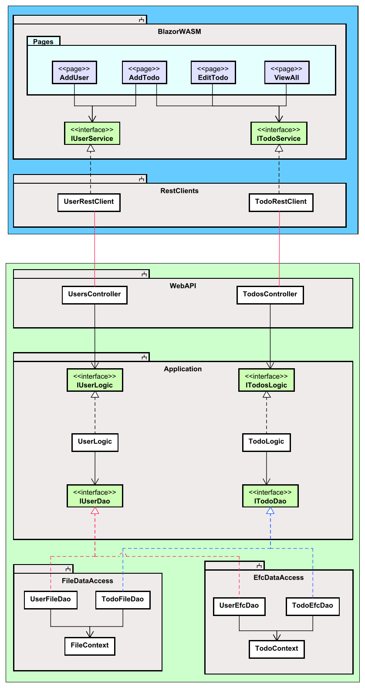

# Architecture overview

This tutorial will be a slightly larger exercise, perhaps sort of a mini-SEP. As such, we wish to have a better code-structure for our application. You have been taught the SOLID design principles. They usually apply to single methods, or classes. In this project we will attempt to apply Clean Architecture, which is basically applying the SOLID principles on a larger scale.

The final system will consist of 2 tiers (client and server), and a total of 5 layers. You have previously encountered a layered architecture, where each layer has a specific responsibility.

Below is a layer diagram for an overview:

The client will be a Blazor WASM UI, using standard HttpClients to make requests to the Server.

The server will use a REST Web API to receive the above mentioned requests. Initially we will store data in a file, using json format. Later, we will swap it out with a database, using Entity Framework Core.

This means, we must design the system, so that this swapping out is easy, and affects as little of the rest of the system as possible. We will apply the Dependency Inversion Principle, and hide the Data Access layer behind interfaces.

## Class diagram

Below, you will find a rough, low-detailed class diagram of the resulting system, after the 3rd tutorial.

The blue box encapsulates the client, and the green box is the server.

### Components

The grey boxes are "components". I will steal the following explanation from Robert C. Martin's book "Clean Architecture":

> Components are unit of deployment. They are the smallets entities that can be deployed as part of a system. In Java, they are jar files. In .NET they are DDLs.

In Java, components are often organized in _modules_. In .NET, components can be organized into various _projects_. 
Components can be considered a bit like lego-building blocks, with the intention that you use these blocks to construct the system. They provide modularity, so building-blocks can easily be swapped out.

There are two Data Access components, because we can use either one. We will start with FileDataAccess and later swap it out with EFCDataAccess.

This layered approach makes the system more modular: 
we can strip out a layer e.g. if we want to use a different type of data access, 
or a different type of network technology. 
We will go with REST for this tutorial series, but later we might want to swap to gRPC or SignalR or something else. 
We can fairly easy remove a "block"/component, and put in something different.

The one thing, which stays fairly static, are the business rules. 
They are less likely to change, and they exist in the Domain component. 
This is also why, we put both Domain- and Dao-interfaces here. 
The Domain classes will always provide access to themselves through the Domain interfaces, 
and they will always need to retrieve and store data through the Dao interfaces. 
But the details of the layer above and below, i.e. network and data access, are irrelevant.

You may notice that arrows point into the Domain, and no arrow points out. This means, the Domain does not depend on anything else.

### Client

The client will (currently planned) have 4 views, or "pages", with which the user can interact.\
Each page will know about a Service interface, which provides functionality to create, get, update, delete either Users or Todos. We have attempted to apply Interface Segregation Principle here.\
These interfaces are implemented by client classes, which can make requests to the server.\
The interfaces are in a separate component, so that we can easily change the UI framework, or we can swap out the client classes, to match whatever network technology the server uses. We could put the interfaces in either BlazorWASM or Clients component, but given that either UI or network can be swapped out, the interfaces would be removed too, and cause problems.

### Server
The server consist of the 3 layers mentioned on the previous slide:
1) WebAPI is the entry point to the server, the Controller classes receive REST requests.
2) The Domain directory contains classes which deal with domain logic and rules. E.g. we might validate a Todo item, the user wishes to create.
3) Data access to provide access to data storage, either as json in a file or data stored in a database.

The architecture may change a bit, as the tutorial moves forward.

There are different approaches on how to structure these components. We will do "by layer", because that is simpler. However, in your professional career, you will probably encounter a separation "by feature". This is an often recommended approach, however much more complicated. Basically, if you want to try it out for SEP3: Each new user story, you implement, will go into a new component.

This may seem a bit overwhelming, but we will take it step by step, holding hands along the way. You will be safe. No worries.

