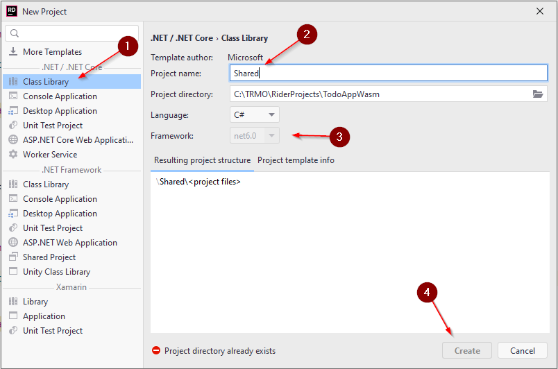

# Shared component

A thing which was abstracted away from the architecture diagram, is where to put out data model classes, i.e. User and Todo.

These will go into their own component, _Shared_. Having these classes in a separate component, means that both the client and the server can reference that component.
It ensures that if a change is made to one of the classes, both client and server will still use the same version.

### New project (component)
Create a new **Class Library** project, by right-clicking your solution:

This will open a familiar dialog, where you can create a Class Library ((1)). 
Give the project a name ((2)), I have called mine "Shared", in some examples it is called Models. 
In your case, you can probably only select net6.0 ((3)), or later. Finally, press <kbd>Create</kbd> ((4)).

A Class Library is a type of project which cannot be run, it instead contains functionality. 
All NuGet packages are generally libraries with functionality, you can import into your system. 
Similar to some Jar files in Java, however, other Jar files can actually be executed. 
In .NET we distinguish between .exe files: executables, and .dll files: dynamic link libraries.

Your Shared component will just contain the Model classes (and a few other things), there is nothing to run. 

The new project, Shared, will contain a single class, ´Class1.cs', you can just delete this.