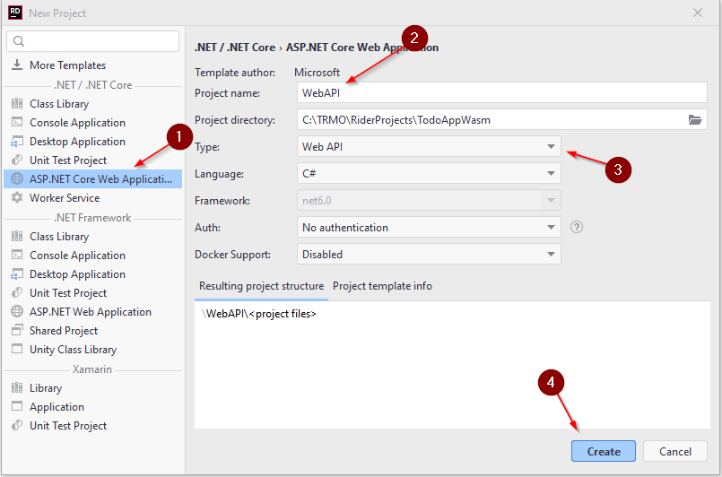
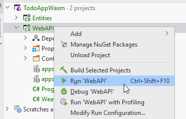
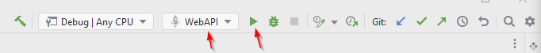

# Creating the Web API

Next up, let's create the Web API component, i.e. the gate-way into our server.

Create a new project, by right-clicking your solution again, and opening the "New Project" wizard.

This time, we need a Web API:

((1)) Web API templates are found under the "ASP.NET Core Web Applications".\
((2)) Give it a name.\
((3)) Select "Web API" here. There are many options. Make sure it is _**API**_, not APP. Two different things. We need an API.

Verify language is C#, net6.0 or later, no Authentication, and no Docker Support.

((4)) Create the project.

### Test

You should now be able to run the Web API, either by right-clicking on the project folder and select "run" 

Or by clicking the green arrow on the top right, with the WebAPI selected in the drop down menu:

### Swagger

When running the Web API, your browser should open a Swagger page, which is a built in client you can use to test your Web API. It's pretty neat.

Currently there is just a GET endpoint, which returns some random weather data.

We will obviously change that later, but we still need a few more components, before we really can get started on the good stuff.