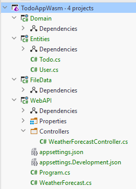
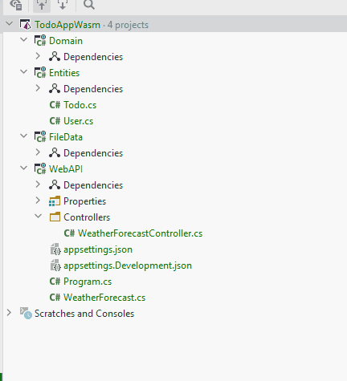

# File Data Component

Now, we just need a final Class Library, call it "FileData", and delete the default class included.

Your solution should now look like this

We have components for the three layers: network, domain, data access. And a component for our model classes, or entities.

### Dependencies

Some components need to know about others, in order to use their functionality or classes. E.g. the FileData component needs to know about the classes in Entities component, and so we need to add a dependency from FileData to Entities.
The DAO classes in FileData also needs to implement interfaces located in Domain, so we need a dependency there as well.

It is done like this:

Now, also add the following dependencies:

1) WebAPI -> Entities
2) WebAPI -> Domain
3) WebAPI -> FileData
4) Domain -> Entities

### Next up

Now we are ready to start implementing functionality.

We will start by getting the storage functionality in place.