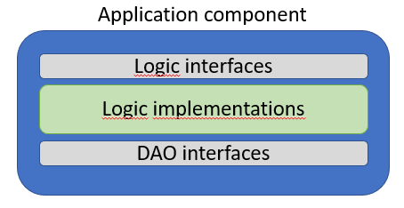

# Logic Layer

This is the Application component, we need the "entry"-interfaces, the logic class, and the Data Access Object interfaces. Nothing else outside of that for now. 

This is the goal for the current slide:



### The logic interface
First, we need to define the access point to the domain logic, i.e. the interface.

Inside the Application component, create a new folder called "LogicInterfaces".

Inside this folder, we will put the interface which provides access to the User logic.
Create a new interface, call it "IUserLogic".


### The data needed
The data we need to provide to create a User can be considered part of the contract.\
In our case it is just a user name. Later, we might need other things like password, email, real name, etc.

We could here use the User class, we previously defined in the Domain component. However, that class contains more properties than what is needed in our case.\
We could just leave some properties empty, but that may not always be convenient. In our case, we will instead create a new DTO with just the properties needed to create a new User.

Inside Domain component, create a new directory, call it DTOs.\
Inside this directory, create the following class:

```csharp
namespace Domain.DTOs;

public class UserCreationDto
{
    public string UserName { get;}

    public UserCreationDto(string userName)
    {
        UserName = userName;
    }
}
```

Do we really need a class just to send that one string around? Strictly speaking, no.\
But, if you have several methods all the way from your front end to here, which just takes a string, and later you figure out, you also need a password, how many method signatures do you have to modify?\
At least a handful.\
If we wrap all relevant data (just the user name for now) in an object, we can easily add another property to the class, and we will have do modify a lot fewer method signatures.

I include the constructor here, because this object should have a "UserName" after its creation.

Now we can define the method in IUserLogic interface:

```csharp
using Domain.DTOs;
using Domain.Models;

namespace Domain.LogicInterfaces;

public interface IUserLogic
{
    public Task<User> Create(UserCreationDto userToCreate);
}
```

The return type is `Task<User>` because we may want to do some work asynchronously. There is nothing yet, but when the database is attached and we use EFC, things will have to be asynchronous.\
The data needed is wrapped in the `UserCreationDta`, i.e. the argument.\
And the data returned is the finalized User object.
In our case, an Id is generated for the new User. In other casees more data could be computed and set. Maybe we want to display the final result to the user of the system, as a kind of verification.
This is common practice.

Why do I not name the method `CreateUser`? That might be more telling about the purpose of the method. However, since I split my Logic interfaces for each domain object, it is implicit that this interface handles Users, and `create()` must then create a user. This is a principle, avoid that kind of duplicate information.

The other method is needed for some validation, you'll see below. It will retrieve an existing user based on the user name.\
We use the question mark `User?` to indicate we might return null, in case no user is found.

### The data storage
We know that we need to store the new User, which we have just created. Let's define the DAO interface for this.

Inside Application component, create the directory "DaoInterfaces".

Inside this new directory, create the following interface:

```csharp
using Domain.Models;

namespace Domain.DaoInterfaces;

public interface IUserDao
{
    Task<User> Create(User user);
    Task<User?> GetByUsername(string userName);
}
```
Here, we take a User object and return a User object. That means the responsibility of converting from UserCreationDto to User lies in the application layer. It is a design choice I have made, that responsibility could be put elsewhere. There are many different approaches. Pick one and be consistent.

Your DAO classes will support CRUD operations (create, read, update, delete). I have defined the following four rules of thumb:

1) Create: receives Domain object, returns Domain object
2) Read: receives search parameters, returns DTO, or sometimes Domain objects
3) Update: receives Domain object, returns void
4) Delete: receives id, returns void

They are not set in stone.

### The logic
Now we have both "borders", we can put the meat in the sandwich, so to say. 
We create the class responsible for handling the process of creating a new User.
The resulting class is [found here](https://github.com/TroelsMortensen/WasmTodo/blob/002_AddUser/Application/Logic/UserLogic.cs).

In Application component, create a new directory: "Logic".\
In here, create a new class: "UserLogic".

It must implement the IUserLogic interface, and it will depend on some way of storing data, i.e. the IUserDao interface, so we start here:


```csharp
using Domain.DaoInterfaces;
using Domain.DTOs;
using Domain.LogicInterfaces;
using Domain.Models;

namespace Domain.Logic;

public class UserLogic : IUserLogic
{
    private readonly IUserDao userDao;

    public UserLogic(IUserDao userDao)
    {
        this.userDao = userDao;
    }

    public Task<User> Create(UserCreationDto userToCreate)
    {
        throw new NotImplementedException();
    }
}
```

The interface is implemented. And the User DAO is received through constructor dependency injection. If we register a UserDAO as a service, the framework will set this up for us. This allows us to adhere to the Dependency Inversion Principle,
i.e. the Logic class knows only about the DAO interface, and its "contract", i.e. "I can save User objects", but the Logic class knows nothing about the DAO implementation, i.e. we are using JSON. This will make it easier to swap out for a real database later on.

Now, we just need to fill out the body of the Create method.

What is involved in creating a User?

* We need to verify the user name is not taken
* We need to verify whatever rules we define about the user name, lets say between 3 and 10 characters.
* We could add many more validation rules, e.g. no vulgar names, or no numbers or whatever. That is outside the scope of this tutorial

So, we implement the body to adhere to the above rules:

```csharp
public async Task<User> Create(UserCreationDto dto)
{
    User? existing = await userDao.GetByUsername(dto.UserName);
    if (existing != null)
        throw new Exception("Username already taken!");

    ValidateData(dto);
    User toCreate = new User
    {
        UserName = dto.UserName
    };
    
    User created = await userDao.Create(toCreate);
    
    return created;
}
```

First we check if the username is taken. If so, an exception is thrown. 
This can be caught in a Controller class in the Web API, and an error code can be returned to the user.\
We don't care how the user is informed about this problem, but **it is important that the user is informed!**

The `ValidateData()` method comes below, it just checks the rules of the username.

A new User object is created, and handed over to the DAO for storage.\
We return the newly created User object, now with an ID too. This ID is generated in the Data layer.

Here we have the validation method:

```csharp
private static void ValidateData(UserCreationDto userToCreate)
{
    string userName = userToCreate.UserName;

    if (userName.Length < 3)
        throw new Exception("Username must be at least 3 characters!");

    if (userName.Length > 15)
        throw new Exception("Username must be less than 16 characters!");
}
```

The length is checked, and if problems are found, an exception is thrown.

The method is `static` because it is a utility method. It just takes an argument, does something with that and either returns void or some object. We don't use any field variables.\
Making the method `static` is a occasional, minor optimization, which your IDE may suggest to you. It is not necessary. 

### Exceptions
Notice how it is always just an `Exception`. This means, the layer above, i.e. the Controllers of the Web API, may not be able to detect what kind of problem we have, and always just returns the same HTTP error code.\
This is not very fine grained, but is acceptable for now.

If you want to improve, you would create new custom Exceptions, e.g. UsernameTakenException, or InvalidUsernameLengthException, etc. Your custom exceptions are just a normal class, which extends `Exception`.\
The Controller above can then catch different types of exceptions, and return a more telling error code. In the case of invalid username, it is a user-error. If something else happens, e.g. there is no connection to the database, it is a server error, resulting in two different HTTP error codes.

These custom exceptions are outside the scope of this project. It is left to the interested reader to implement themselves. Often these exceptions are placed in the Domain component.

Other, perhaps better, alternatives for error handling exists, but these are also outside the scope of this tutorial.

### Test
We are not going to test the functionality in this tutorial, but now we could write unit tests to verify the behaviour and the validation. We would have to create a _Mock_ for the DAO interface, i.e. a dummy implementation which doesn't do much.

But this is a purpose of Domain Driven Design: That you focus on the domain logic first, and that you can then test it.