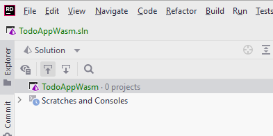

# Creating a new solution

We are going to start out with a new **empty solution**. You might name it "TodoAppWasm", or something else.

Follow the steps below to create a new solution:

Clicking New... will open the dialog for creating a new solution, see below.

((1)) Select Empty Solution\
((2)) Give your solution a name. I have multiple Todo apps by now, so I have called this one "BlazorTodoApp"\
((3)) You can choose to add a git repository, if you wish.

Your new empty solution should now look like this:

I.e. it's pretty empty. Next up, we will talk about the solution structure, which was displayed on the previous slide.