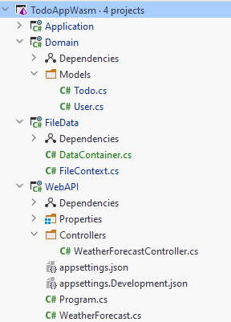
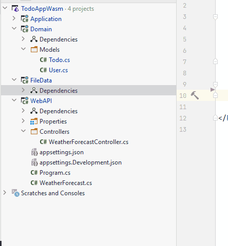

# File Data Component

Now, we just need a final Class Library, call it "FileData", and delete the default class included.

Your solution should now look like this

We have components for the three layers: network, domain, data access. And a component for our model classes, and other domain stuff.

### Dependencies

Some components need to know about others, in order to use their functionality or classes.\
The Data Access Object classes in `FileData` need to implement interfaces located in `Application`, so we need a dependency from `FileData` to `Application`.

It is done like this:

Now, also add the following dependencies:

1) Application -> Domain
2) WebAPI -> Application
3) WebAPI -> FileData

Now, because Application -> Domain, and FileData -> Application, we get a "transitive" dependency: FileData -> Application -> Domain. 
The point is, FileData gets access to the model classes in Domain.'

### Next up

Now we are almost ready to start implementing functionality.

We will start by getting the storage functionality in place.