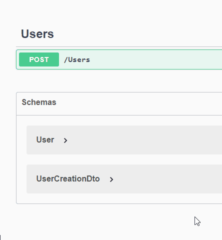

# Testing

It is time to test, what we have done so far.

Run your Web API. It should open the Swagger page in your browser.

Try out the endpoint.




After you have made the request, and gotten a success response, you should be able to find a new file in your Web API component, a file containing our data.

If you inspect the file, you can see:

`{"Users":[{"Id":1,"UserName":"Troels"}],"Todos":[]}`

It is not particularly reader friendly, we will fix that. But, we can see the collection of Users, with my new User. 
And the collection of Todos are currently empty.

Let's make it more reader friendly. Open the FileData/FileContext.cs file. Navigate to the `SaveChanges()` method.
Modify it to be like this:

```csharp
public void SaveChanges()
{
    string serialized = JsonSerializer.Serialize(dataContainer, new JsonSerializerOptions
    {
        WriteIndented = true
    });
    File.WriteAllText(filePath, serialized);
    dataContainer = null;
}
```

This will introduce line breaks to make things more readable. Test the endpoint again with another user, and inspect the file afterwards.

The file content should now look like this:

```json
{
  "Users": [
    {
      "Id": 1,
      "UserName": "Troels"
    },
    {
      "Id": 2,
      "UserName": "Jakob"
    }
  ],
  "Todos": []
}
```