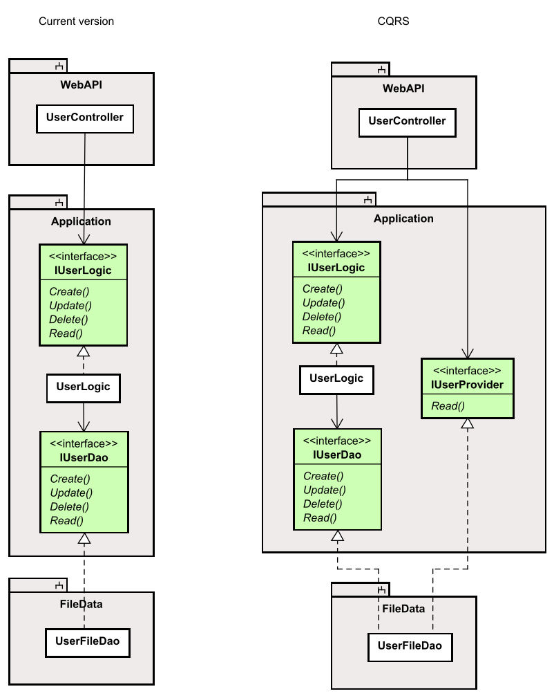

# Logic Layer for Getting Users

Now, there is not really any business logic associated with getting a list of Users, so the functionality in this layer is going to be fairly simple.

### Logic interface
First we need to define what kind of information is needed by the logic layer to retrieve users.

It could be nothing, if we just want all users.\
It could be an Id or user name, if we just want a single user.\
Or it could be a number of filtering criteria, if we had more information about a user.

We are going with the last, and we want to be able to search for users containing a piece of text. E.g. if i searched for "Ja" we might get users Jakob, Jane, Jan, Jasmine.

Now, the method in the interface could then look like this:

`... GetUsers(string containsText);`

However, if we later want to add more search criteria, I would have to modify potentially several method signatures across layers.

Instead, we want to define an object to contain the search variables, a DTO.

###### Note
We have here avoided "the primitive obsession anti pattern". 

### The search filters DTO
Inside Domain/DTOs directory, create the following class:

```csharp
namespace Domain.DTOs;

public class SearchUserParametersDto
{
    public string? UsernameContains { get;  }

    public SearchUserFiltersDto(string? usernameContains)
    {
        UsernameContains = usernameContains;
    }
}
```

The property is marked with "?", i.e. `string?` to indicate this search parameter can be null, i.e. it should be ignored when searching users.

### The interface method
We can now use our new search filter DTO in the method signature in the Logic interface, like so:

```csharp{9}
using Domain.DTOs;
using Domain.Models;

namespace Domain.LogicInterfaces;

public interface IUserLogic
{
    public Task<User> Create(UserCreationDto dto);
    public Task<IEnumerable<User>> GetAsync(SearchUserParametersDto searchParameters);
}
```

We return an IEnumerable<User>. IEnumerable is just a kind of simple, non-modifiable collection. We could use ICollection, IList or something else, but there is a tendency to return IEnumerable for these kinds of things.

### The dao interface method

Let us next define the method in the IUserDao interface. 
We do this before we start on the method implementation in UserLogic, because this implementation will need the method of the DAO interface.

In IUserDao add the same method as above:

```csharp
public Task<IEnumerable<User>> GetAsync(SearchUserParametersDto searchParameters);
```

### The logic implementation
Finally, we define the method in the UserLogic class. It doesn't do anything other than delegate to the layer below:

```csharp
public Task<IEnumerable<User>> GetAsync(SearchUserParametersDto searchParameters)
{
    return userDao.GetAsync(searchParameters);
}
```

Notice that `userDao.GetAsync(searchParameters)` returns a Task, but we don't need to await it, because we do not need the result here.
Instead, we actually just returns that task, to be awaited somewhere else.

Next step would be to implement the search funtionality in the UserFileDao class. It should currently be complaining about not defining an implementation for the method we just defined in IUserDao.

But first, a discussion. It's not needed for this tutorial, but maybe it causes you to reflect a little.

## A comment on architecture

Now, notice how the UserLogic class doesn't do anything, when we ask for data. It just forwards the method call to the Data Access layer below. So, is there really a point in going through the Logic layer for this? It is a fair assumption all data requests will be similar, i.e. the logic layer will do nothing other than just forwarding the request to the Data Access Layer.

The point is, it may seem like silly extra work. We will do this work in this tutorial because it is just simpler for now, but there is another approach.

There is an architectural pattern called "Command Query Response Separation", or "CQRS". The idea here is that you can devide functionality into two areas: commands and queries, i.e. "do something" and "get something".\
That means the "create, update, delete" operations are commands, and here we may need some extra logic, calculations, validations, before the command can be done. This work is done in the logic layer.\
But for the "read" operations, there is no logic, so the CQRS pattern says to split things: 

Have a vertical slice for CUD operations, and another vertical slice for R operations.\
There are different approaches to this, and the seemingly most common one is somewhat complex, relying on various libraries. But we will discuss the basic idea.

Below is the "minimum effort" approach.



The left side is our current approach, in the right side we have split out the "Read" requests into another interface.

We have cut out the "useless" forwarding functionality in the UserLogic. If at some point, we need extra functionality when Reading in the logic layer, we can insert an implementation here, but because the UserController just knows about the interface, this modification should be fairly simple.

Taking it a step further, we could split the UserFileDao implementation into two classes as well.

The CQRS approach is not needed, or required. It is mainly to spark a thought.