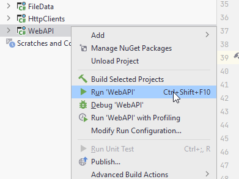

# Introduction

# Please notice!
This guide was written with Blazor-WASM in mind. 
However, I feel it is still easier to work with Blazor-Server.
The debugging and error messaging is better.

Therefore, I suggest you create a Blazor-Server project, instead of a Blazor-WASM. The difference will be tiny, and should have no effect in this tutorial.
# Notice over

This is the _second_ part of a 3 part tutorial series.

You should already have the Todo Web API in place from the first part. We will continue working in the same Solution so as to reuse certain things.

This tutorial will cover the client side, i.e. making a Blazor WASM app.

## Features

We already have the server-side of multiple features from part 1. We will now complete the client side of those features.

1) As a user of the system I can add a new User, so that Todos can be assigned to Users.
2) As a User I can get a list of all existing Users, so that I can assign Todos to them
3) As a User I can add a new Todo, so that I can remember important things
4) As a User I can view all or filtered Todos, so that I can remember what to do
5) As a User I can complete a Todo, so that I can mark things as done
6) As a User I can delete a Todo, so that I can clean up


## Branches

Again, each feature has its own branch on GitHub. Below is an overview:

* [009_ClientSetup](https://github.com/TroelsMortensen/WasmTodo/tree/009_ClientSetup) Here the initial setup of the Client components are done.
* [010_AddUser](https://github.com/TroelsMortensen/WasmTodo/tree/010_AddUser): Add a new User
* [011_ViewUsers](https://github.com/TroelsMortensen/WasmTodo/tree/011_ViewUsers): Show an overview of the registered Users
* [012_CreateTodo](https://github.com/TroelsMortensen/WasmTodo/tree/012_CreateTodo): Create a new Todo
* [013_ViewTodos](https://github.com/TroelsMortensen/WasmTodo/tree/013_ViewTodos): View all Todos
* [014_ViewTodosWithFilter](https://github.com/TroelsMortensen/WasmTodo/tree/014_ViewTodosWithFilter): Adding filtering functionality to the Todo overview
* [015_CheckBoxComponent](https://github.com/TroelsMortensen/WasmTodo/tree/015_CheckBoxComponent): Creating a check-box component
* [016_EditTodo](https://github.com/TroelsMortensen/WasmTodo/tree/016_EditTodo): Edit and existing Todo
* [017_DeleteTodo](https://github.com/TroelsMortensen/WasmTodo/tree/017_DeleteTodo): Delete an existing Todo
* [018_PopupSuccessMessage](https://github.com/TroelsMortensen/WasmTodo/tree/018_PopupSuccessMessage): Show a pop-up message
* [019_StateContainer](https://github.com/TroelsMortensen/WasmTodo/tree/019_StateContainer): Component to component communication

## Running your programs

When you run your programs, either Web API or Blazor app, you **do not use the "IIS Express" version**. That requires extra setup, and I don't really know what it is about.


You can also just right-click your Web API or Blazor project, and run things from there, not worrying about ISS:



### Tired of Swagger opening all the time?
Whenever you need to test something, you almost always need to start your Web API, and then Blazor. And your Web API will open a Swagger page.
If you get tired of this, you can go to WebAPI/Properties/launchSettings.json and modify the following line:

```json{15}
{
  "$schema": "https://json.schemastore.org/launchsettings.json",
  "iisSettings": {
    "windowsAuthentication": false,
    "anonymousAuthentication": true,
    "iisExpress": {
      "applicationUrl": "http://localhost:21227",
      "sslPort": 44331
    }
  },
  "profiles": {
    "WebAPI": {
      "commandName": "Project",
      "dotnetRunMessages": true,
      "launchBrowser": true,
      "launchUrl": "swagger",
      "applicationUrl": "https://localhost:7093;http://localhost:5093",
      "environmentVariables": {
        "ASPNETCORE_ENVIRONMENT": "Development"
      }
    },
    "IIS Express": {
      "commandName": "IISExpress",
      "launchBrowser": true,
      "launchUrl": "swagger",
      "environmentVariables": {
        "ASPNETCORE_ENVIRONMENT": "Development"
      }
    }
  }
}
```

"launchBrowser: true". Change this to false, and the browser will not launch.

You can do the same for the Blazor app. 
In the console in Rider you can also click on the link with https to open a window.\
Whenever you restart the app, you can then just hard refresh the browser with <kbd>ctrl</kbd>+<kbd>F5</kbd>. This usually works.