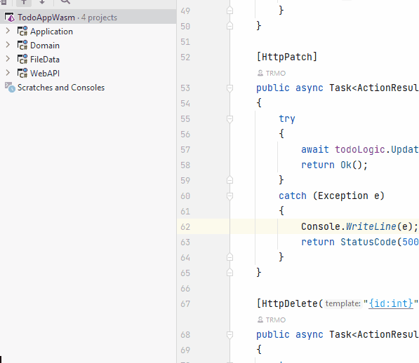

# Creating Components

It's time to create the two new components in your existing Solution.

### Blazor project
Start with a new Blazor WASM project:

### Clients project
Then create a new Class Library, I have called mine HttpClients.

Delete the class "Class1.cs".

### Dependencies

Make inter-component dependencies as follows:

* HttpClients -> Domain
* BlazorWASM -> HttpClients

Now, like last time, this gives us a transitive dependency: BlazorWASM -> HttpClients -> Domain, meaning that the Blazor component has access to everything in the Domain component.

That should be all for setting up. We are ready for the first feature.