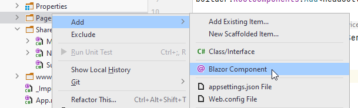

# Add User Page
The Pages directory in your BlazorWASM project will house all Blazor components/pages. You may create sub-directories, if needed, but otherwise I recommend putting all blazor components in here.


## Create Page
In the Pages folder, create a new Blazor component, call it "CreateUser":



And then:


If you make a Component instead of a Page, it can still be fixed. The only difference is that Pages come with the @page directive at the top:

```
@page "/CreateUser"
```

If you created a component, this is not there, but can just be added.

You should now have this content in your page:

```razor
@page "/CreateUser"
<h3>CreateUser</h3>

@code {
    
}
```

## The Code
Let's start with the code block, i.e. what will essentially be your view-model. My style is typically to have the code block inside the page, as shown above. But if you prefer to do code-behinds, you're welcome to do that.

We need an object to hold the data, that the user inputs. And we need a method to send that data to the UserService.

It looks like this:

```csharp
@code {
    private string username = "";
    private string resultMsg;
    private string color;
    
    private async Task Create()
    {
        resultMsg = "";

        try
        {
            await userService.Create(new UserCreationDto(username));
            username = "";
            resultMsg = "User successfully created";
            color = "green";
        }
        catch (Exception e)
        {
            Console.WriteLine(e);
            resultMsg = e.Message;
            color = "red";
        }
    }
}
```

Three field variables. The `resultMsg` is to hold any messages, we wish to display to the user. Maybe something fails on the server side, e.g. the user name was already taken. We wish to display that information to the user. Remember, feedback is important.\
The `color` is to set the color of the resultMsg in the view, see below. 

The `Create()` method does very little. We reset the `resultMsg` first. Then a call to the `IUserService` with a new UserCreationDto containing the user name.

If something goes wrong, we catch any potential exceptions, and display their message, by putting it into the `resultMsg` variable, which causes an update to the view, which will be re-rendered.

## The View

Next up, the view definition.

As a minimum we need an input field, so that the user can input the wanted user name.\
We also need a button, which when clicked, will call the `Create()` method.\
And then we need a way to display messages held in the `resultMsg`.

I have added a little extra, which will be explained, and then the view looks like this:

```razor
@page "/CreateUser"
@using Domain.DTOs
@using HttpClients.ClientInterfaces
@inject IUserService userService;

<div class="card">
    <h3>Create User</h3>
    <div class="input-area">
        <label>User name:</label>
        <input type="text" @bind="username" @bind:event="oninput"/>
        @if (!string.IsNullOrEmpty(resultMsg))
        {
            <label style="color: @color">@resultMsg</label>
        }
    </div>
    <div class="button-row">
        <button @onclick="Create" disabled="@(string.IsNullOrEmpty(username))">Create</button>
    </div>
</div>
```

**Line 1**: This is the page directive. It defines the sub-uri to access this specific page.\
**Line 2-3**: Importing various namespaces.\
**Line 4**: Here we inject an instance of `IUserService`. 
This instance is created an provided by the dependency injection framework, and we can do this, when we have registered the interface and implementing class as services in Program.cs, as we did the previous slide.\
We hereby achieve dependency inversion, and if we were to change the network technology, the idea is, we shouldn't have to rework any of our pages, because they just know about the interface.\
However, because we decided to put the interfaces into the HttpClients component, we would still have to modify all pages, if we changed network technology. Notice the using statement in line 3, this references the namespace HttpClients. We have chosen to accept this flaw, as we will not change network technology. Remember the discussion on slide 2 on where to put the interfaces.

Then comes a mix of HTML and razor-syntax, i.e. inlined C#.\
First there is a containing `<div>` in line 6. We will add some styling later to setup the page a little nicer.

The first interesting thing comes in **line 10**. This is a text input field:

```razor
<input type="text" @bind="username" @bind:event="oninput"/>
```

We have two "@-attributes". The first one says that the value of the text field should be stored in the field variable `username`.

The second `@` is then the type of event, which should cause the value of the input field to be put into the field variable. 
We want it to be "oninput", i.e. each key press will cause an update to the value of the field variable. 
The default is "onchange", which will cause the update when you de-focus the text input, i.e. click somewhere outside of it. If we just want the default onchange we can leave out the second `@bind:eve...`.\
We want the "oninput", because the button should be  disabled, when there is nothing in the input field.

**Line 11-14**: This is a code snippet, started with the `@` to indicate some razor-syntax follows, which should be evaluated when generating the html.\
We check if there is anything in the `resultMsg` field, and if so, we display a `<label>` with whatever error message should be shown. If the `resultMsg` is empty, the HTML inside the if-statement is not rendered.

**Line 17**: Here we have the button to be pressed when creating a user:

```csharp
<button @onclick="Create" disabled="@(string.IsNullOrEmpty(username))">Create</button>
```

We specify the method to be called when the button is clicked with `@onclick="Create"`. We could also here provide a lambda expression instead of the method name.\
THen the `disabled=` is a standard HTML attribute, which value must be "true" or "false". 
Here we evaluate the state with `@(string.IsNullOrEmpty(username))`, the @ indicating razor-syntax to be avaluated when rendered. We check if the `username` has a value. If there is no value, it doesn't make sense to be able to click the button, so it will be disabled.


## Adding access to the Web API

Currently, your Web API does not have CORS enabled, which prevents your Blazor app from accessing an API.

In your WebAPI/Program.cs add the following:

```csharp
app.UseCors(x => x
    .AllowAnyMethod()
    .AllowAnyHeader()
    .SetIsOriginAllowed(origin => true) // allow any origin
    .AllowCredentials());
```

It must be after the app variable is defined.

If you which to know more about CORS, [read here](https://developer.mozilla.org/en-US/docs/Web/HTTP/CORS). For this course, it is just something we enable, without caring too much about it. It is a security measure, which we are disabling.

## Test

We should now have the functionality in place. We will add a bit of styling later, but let's test it first.

Run first your Web API. You can just close the Swagger page, which opens.

Run then the BlazorWASM. It should open a new tab in your browser.

In the address bar put "https://localhost:7205/CreateUser" to navigate to the page, we have just worked on.

You should then see your page:


Type in something in the text-field and see how the button becomes enabled.

Try first a user name, you know exists. We should see an error message.

Then try a new user name, non-existing. This should work, and you should see a green success mesage.
