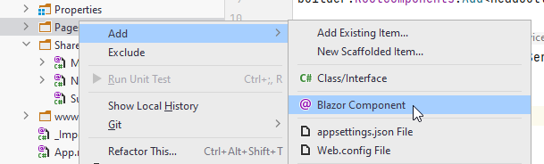
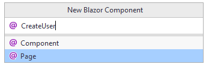

# Add User Page
The Pages directory in your BlazorWASM project will house all Blazor components/pages. You may create sub-directories, if needed, but otherwise I recommend putting all blazor components in here.


## Create Page
In the Pages folder, create a new Blazor component, call it "CreateUser":



And then:



If you make a Component instead of a Page, it can still be fixed. The only difference is that Pages come with the @page directive at the top:

```
@page "/CreateUser"
```

If you created a component, this is not there, but can just be added.

You should now have this content in your page:

```razor
@page "/CreateUser"
<h3>CreateUser</h3>

@code {
    
}
```


