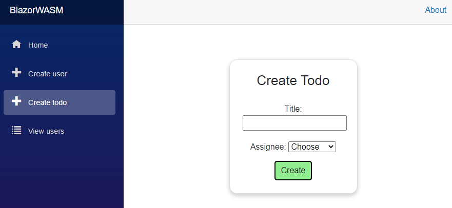

# Add Todo Page
Next up is the UI. 

Create a new Page, call it "CreateTodo". Leave it empty for now.

## Nav Menu
Add a new nav menu item to the nav menu, so that we can easily open the CreateTodo page.

## Code block

We start with the code block.

We need to initially load the users. And we need a method to take the input, wrap it up and forward it to the client class.

It looks like this. Read through it, see if it makes sense, then read the comments below:

```csharp
@code {
    private IEnumerable<User>? users;
    private int? selectedUserId;
    private string todoTitle = "";

    private string msg = "";

    protected override async Task OnInitializedAsync()
    {
        msg = "";
        try
        {
            users = await userService.GetUsers();
        }
        catch (Exception e)
        {
            Console.WriteLine(e);
            msg = e.Message;
        }
    }

    private async Task Create()
    {
        msg = "";
        if (selectedUserId == null)
        {
            msg = "You must select an assignee!";
            return;
        }
        if (string.IsNullOrEmpty(todoTitle))
        {
            msg = "Title cannot be empty!";
            return;
        }

        try
        {
            TodoCreationDto dto = new((int)selectedUserId, todoTitle);
            await todoService.CreateAsync(dto);
            navMgr.NavigateTo("/");
        }
        catch (Exception e)
        {
            Console.WriteLine(e);
            msg = e.Message;
        }
    }
}
```

The first field holds the users. They are retrieved when the page is loaded, using the `OnInitializedAsync()` method, overridden from the ComponentBase super class.

The second field hold the selected User id. Initially no user is selected, so the value must be `null`.

The third field is for the Todo title.

And the fourth is for any messages, in case of errors and such.

The method `OnInitializedAsync()` just fetches all Users from the server.

The `Create()` method will first reset the `msg`. Then we check if User and Title is set. This is also checked on the server, but we do a basic check here, so we don't have to contact the server if the User have not filled out everything.\
Then a new `TodoCreationDto` is created, this class already exists in the Domain component, it is what the Web API requires. It is handed over to the ITodoService to be sent to the server.

In both methods we catch any potential errors from the layer below, and display the message through the `msg` field.

#### NavigationManager
After the call to the `ITodoService::CreateAsync()` we do something different. For the CreateUser page, we would just display a message saying success. Here we take the opportunity to introduce a new helper class, the `NavigationManager`  

This class is injected like the services, see below. It is by default available, we do not need to register it as a service, and we can use it to navigate to a different page. So far, the user has been in control of navigating between pages in the app, by clicking the menu items. 
But sometimes something happens, and we want to take the user to a different page.

The argument `("/")` is the URI of the page we want to display. For now, we navigate to the home page. Later we will change this, so we are taken to the Todo overview page. The argument will then be `("/ViewTodos")`.

No success message is shown to the user now, only in case of errors. Whether that is user friendly is less relevant for the example. It will be changed later, though.
## The View

Again we have to do the if-else if-else thing to check for Users. If there are users, we display the input elements for creating a Todo.

It looks like this:

```razor
@page "/CreateTodo"
@using HttpClients.ClientInterfaces
@using Domain.Models
@using Domain.DTOs
@inject IUserService userService
@inject ITodoService todoService
@inject NavigationManager navMgr

<div class="card">
    @if (users == null)
    {
        <label>Loading users...</label>
    }
    else if (!users.Any())
    {
        <label>No users, you cannot create a Todo without assignee.</label>
    }
    else
    {
        <h3>Create Todo</h3>
        <div class="form-group field">
            <label>Title:</label>
            <input type="text" @bind="todoTitle"/>
        </div>
        <div class="form-group field">
            <label>Assignee:</label>
            <select @bind="selectedUserId">
                <option>Choose</option>
                @foreach (User user in users)
                {
                    <option value="@user.Id">@user.UserName</option>
                }
            </select>
        </div>
        <div class="button-row">
            @if (!string.IsNullOrEmpty(msg))
            {
                <label style="color: red">@msg</label>
            }
            <button @onclick="Create" class="acceptbtn">Create</button>
        </div>
    }
</div>
```

Page directive first, then importing namespaces, and we inject both `IUserService`, `ITodoService`, and the `NavigationManager`.

Everything is wrapped in a `<div>`, we will make it card-ish, like we did with the create User page.

Then we have the if-else if-else. It is similar to the ViewUsers page, same purpose.\
If there are Users, the input elements are displayed.\
There is a header, `<h3>` and then a `<div>` containing a simple text input field, the value of which is bound to the field variable `todoTitle`.\
This time, we just use the default @bind, but don't specify an event. This means the value of todoTitle will be updated, when the input field is de-focused, i.e. you press enter, or click outside of it.

Then the next div to hold a drop down menu. In HTML that is a `<select>`. Here we bind the value of what is selected to the field `selectedUserId`.\
We use a `@foreach` to generate all the options in the `<select>` tag. The `value="@user.Id"` in _line 31_ specifies what will be pushed to the field variable `selectedUserId`. The `@user.UserName` is what will be displayed.\
I have included a "dummy option", called "Choose" before the for-loop, just so that you have to make an active choice.

In the last div, we have the error message, and the button.

We could apply the same logic as seen in CreateUser page, where the button is disabled when there is no valid data. But here we see a simpler approach, just for some diversity.

#### Comment
This simpler approach is not necessarily better. In general your UI becomes more user friendly, if you can block a user from doing something, rather than let them attempt something and get an error response.

So, not being able to click a button, when the input is not correct can be an improvement. However, sometimes it may not be clear why a button is disabled. So on the other hand, if you leave it enabled, the user can click it and get a message saying what the still need to fill out.\
You have to help your users, and spend some time figuring out the best way.

## Styling
Create a style-behind for `CreateTodo.razor`. Insert the following styles (actually just copied from the style of CreateUser.razor.css):

```css
.card {
    box-shadow: 0 4px 8px 0 rgba(0, 0, 0, 0.2);
    transition: 0.3s;
    width: 250px;
    padding: 25px;
    text-align: center;
    margin: auto;
    margin-top: 50px;
    border-radius: 15px;
}

.field {
    margin-top: 20px;
}

.acceptbtn {
    background-color: lightgreen;
    border-radius: 5px;
    padding: 5px;
    padding-left: 10px;
    padding-right: 10px;
}

.button-row {
    margin-top: 15px;
}
```

Yes, it is identical to what you have in another page. We will optimize below, after testing.

## Test

Run the Web API and your Blazor app. Open the page to create a new Todo. It should look like this:



Do some sunny and rainy tests. Verify you get error messages as expected, and verify the Todo goes into the data.json file in WebAPI component, when succeeding in creating a Todo.


## Refactoring Styles
Now, because we are using the same styles twice, it would be a good idea to centralize it, make the styles available app-wide.
If I wish to update the color of accept buttons, I would now have to do it in two places. Repeating code is rarely good.\
We could just copy the style into the existing default file here: BlazorWASM/wwwroot/css/app.css.\
This file is "global", i.e. styles here are accessible across your app. 
When doing style-behinds, those styles are available only to that specific page. Officially, I believe they are called "isolated css"

Alternatively we can create a new global style sheet, let's do that, so you see how it is done.

At this location: BlazorWASM/wwwroot/css create a new file: "styles.css". Or whatever you want to call it.\
Copy the styles from your style-behind in here.

We then need to tell the app to load this style sheet too. Open BlazorWASM/wwwroot/index.html.

Inside the `<head>` tag add the highlighted line:

```html{8}
<head>
    <meta charset="utf-8" />
    <meta name="viewport" content="width=device-width, initial-scale=1.0, maximum-scale=1.0, user-scalable=no" />
    <title>BlazorWASM</title>
    <base href="/" />
    <link href="css/bootstrap/bootstrap.min.css" rel="stylesheet" />
    <link href="css/app.css" rel="stylesheet" />
    <link href="css/styles.css" rel="stylesheet" />
    <link href="BlazorWASM.styles.css" rel="stylesheet" />
</head>
```

Notice how the already existing app.css is loaded in line 7. And by default a non-existing style-sheet with a name matching your project name is loaded in line 9. For whatever reason.

### Delete style behinds.

Now delete the two style behinds `CreateTodo.razor.css` and `CreateUser.razor.css`. Or do a "soft-delete" by just commenting out the content in those two files for now.

Sometimes a Blazor app does not reload new styles correctly, and you will have to press <kbd>ctrl</kbd>+<kbd>F5</kbd> in your browser to do a hard refresh. And maybe a clean-rebuild of the project too:

