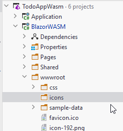

# View Todos With Filtering

~~[This part of the feature is in a new branch here]()~~ -> apparently I forgot to create a new branch, so...


We will continue on the View Todos page, by adding some filtering functionality to it. 

This requires four input fields in the view. The data of these should then be passed to the `ITodoService`.

Our Web API should already be able to handle things from there.

## Icons

We are going to use two icons, which will be clicked to show/hide the filter inputs.

First, create a directory called "icons" here:



This directory will house our icons. Since they are inside the "wwwroot" we can easily use them in the pages.

Next, download the two following funnel icons, and place them into the directory. You should be able to right click them, and select to "save as". [Otherwise find them here](https://github.com/TroelsMortensen/WasmTodo/tree/014_ViewTodosWithFilter/BlazorWASM/wwwroot/icons)


We will use these icons as buttons to open/close the filters. Take a moment to appreciate the icons, I made them myself.


## Code Block

We must provide field variables to hold the data for the new input fields. They must be passed to the call to get Todos from the ITodoService.

It looks like this:

```csharp{6-9,20}
@code {
    private IEnumerable<Todo>? todos;
    private string msg = "";
    private bool doShowFilters = false;

    private string? usernameFilter;
    private int? userIdFilter;
    private string? completedStatusFilter;
    private string? titleContainsFilter;
    
    private async Task LoadTodos()
    {
        try
        {
            bool? completedFilterValue = null;
            if (!string.IsNullOrEmpty(completedStatusFilter) && !completedStatusFilter.Equals("all"))
            {
                completedFilterValue = bool.Parse(completedStatusFilter);
            }
            todos = await todoService.GetAsync(usernameFilter, userIdFilter, completedFilterValue, titleContainsFilter);
        }
        catch (Exception e)
        {
            Console.WriteLine(e);
            msg = e.Message;
        }
    }
}
```

In lines 15-19 we get the value of the input field for the completed status. 
We are using a drop-down menu, with the values "all", "true", "false". And so, if `all` is selected, the filter is not applied. Otherwise the value is parsed to a boolean.\
All four fields are nullable, so we can choose to not provide a value, to indicate a specific filter should be ignored.

Notice also the field variable `doShowFilters`, which is used to determine whether the filters should be shown or not.

## View
We must update the view to display the four new required input fields. We will make a show/hide functionality using the funnel icons from above.

Below is shown the first part of the updated view, but the table definition is not shown, as it is not relevant for this.

```razor
@page "/ViewTodos"
@using Domain.Models
@using HttpClients.ClientInterfaces
@inject ITodoService todoService

<h3>Todos</h3>
<div class="filter-bar">
    <div class="filters-container">
         doShowFilters = !doShowFilters)" alt="Funnel"/>
        @if (doShowFilters)
        {
            <div class="filter">
                <label>Username:</label>
                <input type="text" @bind="usernameFilter"/>
            </div>
            <div class="filter">
                <label>User id:</label>
                <input type="number" @bind="userIdFilter"/>
            </div>
            <div class="filter">
                <label>Is completed?</label>
                <select @bind="completedStatusFilter">
                    <option value="all">All</option>
                    <option value="true">Yes</option>
                    <option value="false">No</option>
                </select>
            </div>
            <div class="filter">
                <label>Title contains:</label>
                <input type="text" @bind="titleContainsFilter"/>
            </div>
        }
    </div>
</div>

<div>
    <button @onclick="LoadTodos">Load</button>
</div>

... 
```

The new part is from the `<div>` tag, with the class of "filter-bar". Here we create a container to hold the filter input fields.

The `` tag displays either the "funnel" icon or the "clear_funnel" icon, based on the value of `doShowFilters`. This part here:

```razor
src="icons/@(doShowFilters ? "clear_" : "")funnel.png"
```

Inside the parenthesis is a "ternary expression", it is a short-hand if-then-else. If `doShowFilters` is true, the "clear_" is returned, otherwise the "". The value is then put together with `funnel.png`. So the src value will be either:
* clear_funnel.png
* funnel_png

There is an onclick handler attached, with the `@onclick`, containing the following lambda expression:

```csharp
() => doShowFilters = !doShowFilters
```
What this will do is simply to just flip the value of doShowFilters. If it is `false`, it will become `true` and vice versa.

Then we have the `@if`-statement checking if the filter inputs should be displayed. We have:
1) First a text input for the User name.
2) Then a number input to filter by User ID.
3) Then a drop down, i.e. `<select>`, with three values: all, true, false. If all is selected, this filter is not used.
4) And finally a text input to check if the Title of a Todo contains the inserted text.

The div and nested button below (lines 36-38) already existed, they are merely included so that you can see what part of the view is ne, i.e. most of the above.

## Styling

We do need a bit of styling, e.g. the icons are too large (they are .png files, and should have just been made smaller, e.g. 30 by 30 pixels), and the filters should be organized just a little bit.

Create a style-behind, "ViewTodos.razor.css", and paste in the following style:

```css
.filter-bar {
    border: 1px solid #ccc;
    border-radius: 10px;
    padding: 5px;
    display: inline-block;
    margin: 10px;
}

.funnel{
    width:30px;
    height:30px;
    cursor: pointer;
}

.filter {
    border: 1px solid #ccc;
    border-radius: 5px;
    padding: 5px;
    margin: 5px;
    text-align: center;
}
```

You are obviously welcome to fiddle around, if you wish to make it prettier.

## TodoHttpClient
In this class we need to take the filter arguments and construct a string of query parameters to suffix to the URI.

We make the following changes. There is a new line of code in the existing `GetAsync()` method, the first line of the method body. We use the `query` in line 5 as the method argument.

And a new method.

```csharp{3,5}
public async Task<ICollection<Todo>> GetAsync(string? userName, int? userId, bool? completedStatus, string? titleContains)
{
    string query = ConstructQuery(userName, userId, completedStatus, titleContains);

    HttpResponseMessage response = await client.GetAsync("/todos"+query);
    string content = await response.Content.ReadAsStringAsync();
    if (!response.IsSuccessStatusCode)
    {
        throw new Exception(content);
    }

    ICollection<Todo> todos = JsonSerializer.Deserialize<ICollection<Todo>>(content, new JsonSerializerOptions
    {
        PropertyNameCaseInsensitive = true
    })!;
    return todos;
}

private static string ConstructQuery(string? userName, int? userId, bool? completedStatus, string? titleContains)
{
    string query = "";
    if (!string.IsNullOrEmpty(userName))
    {
        query += $"?username={userName}";
    }

    if (userId != null)
    {
        query += string.IsNullOrEmpty(query) ? "?" : "&";
        query += $"userid={userId}";
    }

    if (completedStatus != null)
    {
        query += string.IsNullOrEmpty(query) ? "?" : "&";
        query += $"completedstatus={completedStatus}";
    }

    if (!string.IsNullOrEmpty(titleContains))
    {
        query += string.IsNullOrEmpty(query) ? "?" : "&";
        query += $"titlecontains={titleContains}";
    }

    return query;
}
```

So, the second method, `ConstructQuery(...)` is the interesting one.

It will check each filter argument, check if they are not null, in which case they should be ignore. 
And otherwise include the needed filter argument in the query parameter string.

Results could for example be:

* "?username=Troels&titlecontains=hej"
* "?userid=3"
* "?completedstatus=false&titlecontains=hej"

The query string must always start with a "?", and each query is separated with "&".

This is achieved by all the ternary expressions, e.g. `query += string.IsNullOrEmpty(query) ? "?" : "&";`. The `query` variable is expanded upon for each if-statement.\
If `query` is empty, it means we are about to append the first query parameter, and the string must start with "?". If the `query` is _not_ empty, we are about to append another query parameter, and so we must insert "&" to separate the existing with the new parameter.

The result of this method, the finished query string, is returned, and appended to "/todos", so that they can be passed to the endpoint handling GET requests of "/todos".

###### Thoughts
As discussed in the tutorial of the Web API, when constructing the endpoint we are using here, it was discussed to instead use a POST with an object containing the query parameters. This might have been simpler. 
And easier to expand upon.\
If we wish to add another query parameter, or remove one, we currently have to modify various things in: ViewTodos.razor, ITodoService, TodoHttpClient, TodosController. And also the TodoFileDao class.

However if the arguments were wrapped in an object, which would be created in ViewTodos.razor, it would be like a tunnel, and we would only have to modify the two ends, in this case: ViewTodos.razor, and TodoFileDao. So, in general it is better practice to wrap multiple simple type parameters into a single object.  

## Test

We are ready to test the filtering.

First, you may need to add a couple of Todos, so you have at least 10 with various values. The completed status must be manually changed from "false" to "true" in the `data.json` file, do this for a few Todos.

Run the Web API, then run the Blazor App.

Navigate to the page.

First just click load without applying filters, to verify that we didn't break anything.

Then play around with the filters, apply one or more in various combinations to verify the result is as expected. 