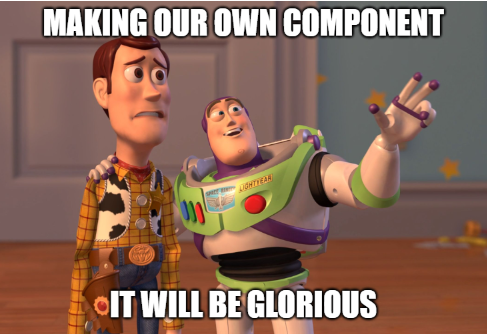

# Making a Checkbox Component

We are about to let users complete Todos. We will do this in the existing ViewTodos page. The table has a column to display the status of a Todo, currently as a piece of text. We will change this to be a check-box.

This gives us an opportunity to create our own fancy checkbox as a component, to show an example of how to use components. So, before starting on the user story, we will make this fancy check box.

[This part of the tutorial is found here](https://github.com/TroelsMortensen/WasmTodo/tree/015_CheckBoxComponent)

## What Are Components?

Blazor is relying on a component structure. Here we talk about Blazor-components, not the components mentioned in the discussion of architecture, i.e. the projects in your solution.

You don't strictly need components, we have not used them so far, and we have done just fine, but they can provide various benefits.

Various UI elements can be made into components, so that they can be reused, without you having to copy-paste code. This can be very convenient.

Consider the "Create"-button we used in both CreateTodo and CreateUser. 
It looked the same, had the same styling, it could have the same functionality (with the disabling).\
Currently we have duplicated the HTML and code, but we could make the button into a component, and have the HTML, code, styling, and behaviour in just one place. Then it would be easy to use it all over our app, and if we needed to change something, e.g. make the color a slightly different shade of green, or add some disabling effect, or some other behaviour, everything is located in one place. We would need to only update on place. And so we would follow the [DRY principle](https://en.wikipedia.org/wiki/Don%27t_repeat_yourself), i.e. don't duplicate code.  

You can create your own components, which we are about to. You can also import libraries of components made by others. Here are some popular ones, if you are curious.

* Blazor fluent UI, found [here](https://www.blazorfluentui.net/)
* Radzen, found [here](https://www.radzen.com/)
* Syncfusion, found [here](https://www.syncfusion.com/blazor-components)
* Blazored, found [here](https://giters.com/Blazored)
* AntBlazor, found [here](https://antblazor.com/en-US/)
* MudBlazor, found [here](https://mudblazor.com/)

We will make a component now, just a simple check box, and then we will use that in the next feature to complete Todos.

