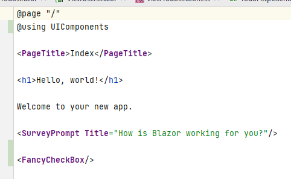

# Checkbox Component

## Purpose
The main purpose here is the introduction to the concept of Blazor components.

A secondary purpose is to show one way of passing parameters to a nested component, from a parent component/page. This will also be discussed again towards the end of the tutorial.


## Let's Go

We start by creating a new component file. It is the same as what we have done when creating pages, we just don't need the @page directive at the top. That is the only difference.

First, we might want to organize our files a bit, create a new directory inside Pages, call it "UIComponents".

Inside this new directory, create a new component, call it "FancyCheckBox".


And then:


This will give you a file with the following content:

```razor
<h3>FancyCheckBox</h3>

@code {
    
}
```

Notice, the only difference of a new Page and new Component, is that the Page has the @page directive at the top. We can manually add a @page directive, and turn this component into a page.

Remember, Pages can work as Components too, even though that may be less standard.

In this file, FancyCheckBox, we just want to have HTML for a checkbox, a little bit of functionality, and some styling, for the "Fancy" part.

## The Code

We just need the initial value of the `Todo::IsCompleted`, and we need a call-back delegate. 
When the value of this component changes, we want to set the value of the `Todo::IsCompleted` property. 
Think observer pattern, so we use a delegate. 
Or more specifically, we use a sub-class called `EventCallback<..>`, which is generally used in Blazor, in part because of async capability.

So, the code looks like this:

```csharp
@code {
    
    [Parameter]
    public bool IsCompleted { get; set; }
    
    [Parameter]
    public EventCallback<bool> OnChange { get; set; }
}
```

We have the two properties, one for the initial value, `IsCompleted`, and a delegate to notify interested parties of changes, the `OnChange`.\
But each have an attribute, `[Parameter]`, now what's that about?


When you instantiate new classes in C#, they often have a constructor, so that you can pass arguments to the class.

What we have here is similar. Wherever we use this component (which may be many places across a large app), 
we wish to provide it with some initial data, i.e. the value of `IsCompleted`, and we may want to subscribe methods to the `OnChange`. This must be done from the "outside" of this component.

We can set these properties from the outside, when we mark them with `[Parameter]`. We will see how shortly.

The point is, initially the checkbox value must be set to either true or false, given the value of the specific Todo. And we must subscribe a method to be invoked, whenever the checkbox is clicked, so that we may update the todo.

Let's take a look at that.

## The View
Now, I style this specific checkbox visual from some online example, and it is obviously more fancy than what we need. We could just use the default HTML-checkbox, but that is dull. And I have been waiting for an opportunity to apply this. So, here we are

This is the view:

```razor
@namespace UIComponents

<label class="checkbox-container">
    <input 
        type="checkbox" 
        class="checkbox-input" 
        checked="@IsCompleted" 
        @onchange="@((arg) => OnChange.InvokeAsync((bool)arg.Value!))"
    />
    <span class="checkbox-span"></span>
</label>
```

First, because the file is not located directly inside the Pages directory, we must define a namespace. We will use this namespace in other pages/components to import this functionality.

There is a surrounding label with some styling. Inside there is an input of type checkbox, and a span, which is used for for the graphics.\
Let's take a closer look at the `<input ../>`:

```razor
<input 
    type="checkbox" 
    class="checkbox-input" 
    checked="@IsCompleted" 
    @onchange="@((arg) => OnChange.InvokeAsync((bool)arg.Value!))"
/>
```
Line 2: We define the input type to be a checkbox.\
Line 3: We define the styling class.\
Line 4: We set the initial value of the checkbox to the value from the property.\
Line 5: We define what should happen, when the value changes: we provide a lambda expression, which just invokes the `OnChange`, i.e. we invoke subscribed methods.

Finally..

## The Styling
It looks like this, put it in a style-behind of the FancyCheckBox.

```css
.checkbox-container {
    display: inline-block;
    width: 30px;
    height: 30px;
    cursor: pointer;
}

.checkbox-input {
    position: absolute;
    transform: scale(0);
}

.checkbox-input:checked ~ .checkbox-span {
    transform: rotate(45deg);
    width: 15px;
    margin-left: 8px;
    border-color: #24c78e;
    border-top-color: transparent;
    border-left-color: transparent;
    border-radius: 0;
}

.checkbox-span {
    display: block;
    width: inherit;
    height: inherit;
    border: 3px solid #434343;
    border-radius: 6px;
    transition: all 0.375s;
}
```

I don't particularly care about what it does.

## Initial Test
Before actually taking it in use, let's test if the graphics work as expected.

Open the page Index.razor file.

Modify it to look like this:

```razor
@page "/"
@using UIComponents

<PageTitle>Index</PageTitle>

<h1>Hello, world!</h1>

Welcome to your new app.

<SurveyPrompt Title="How is Blazor working for you?"/>

<FancyCheckBox/>
```

Notice the second line, where we import the namespace, defined in the FancyCheckBox component file.

And then the bottom line, where we insert the component. It almost looks like we are just using a normal HTML tag.

Your IDE, however, should color code it different from standard HTML. Here's what my theme looks like:



Notice the component is in purple, same as the SurveyPrompt, which is another component, that came with the template project. `<PageTitle>` is again also a component, defined in the Blazor framework. Also notice the naming convention of components versus HTML: PascalCase vs alllowercase.

Now, go ahead and delete the line `@using UIComponents`, and you should see your component change color to that of HTML, in my case blue. The colors help to indicate that you may have forgotten to import a specific component, and so it will not show up in the UI, when running the app.This often happens.

**Put the using statement back again.**

When the UI is rendered, the content of the component is extracted, and inserted into the final page, so when you inspect the HTML of the UI in the browser, you will not see that some of the HTML came from a component.

You can duplicate the line of `<FancyCheckBox/>` a couple of times to get more checkboxes. That's the easy re-usability mentioned earlier.

Sometimes components are made for re-usability, but I find that often components are made because your page grows too large. You can then take parts of a page, and refactor out into a new component. This can be a very good way to organize your pages.

Now, the test. Run your Blazor app, we don't need the Web API for this, as we are not retrieving any data just yet.

Your front page should now look like this:


My god, is that fancy or what?!


Okay, we haven't provided any parameters to it just yet. So let's go and use it for real. 

You may delete the component from the Index.razor page, if you wish.